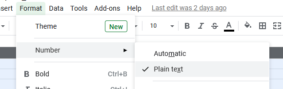

# Creating An AMI Inventory for ArchivesSpace Import
After you have exported the inventory spreadsheet, fill in the descriptive metadata directly from the text on the media object. If the object has already been digitized, you should also view the recording in EAVie to verify the accuracy of the description on the physical object. You should complete your inventory with the final collection arrangement in mind. Try to group the media into subseries or topical groups whenever possible using the _group_ column, and avoid repetition and unnecessary text whenever possible. For example, if a piece of media is titled with the collection name followed by the name of a song, you only need to record the song title in the _title_ field.

When completing your inventory, you do not need to complete all fields of your exported SPEC spreadsheet. Fields like the _Classmark_ are relatively rare. The purpose of the audio and moving image description in the finding aid is to most accurately describe the content of the media. If the media you are inventorying contains a lot of annotations or notes on the container which have research value, consult with your supervisor about the best way to capture and describe this content. In certain cases, a decision may be made to scan the media. In this case a note will be included in the finding aid indicating how researchers can access this scanned content.

As you inventory and describe AMI, remove any loose papers and documentation found inside a media enclosure, and place these in a folder labeled with the identifier number of the Media Original item. By retaining this information, you will be able to describe the paper and AMI together in the finding aid. It is generally best to integrate each separated paper into the container list. For some legacy collections where the papers have already been separated and their origin is unclear, you may need to create a file with a title such as, _Separated Papers_, that includes all the separated items. 

When you have sufficiently cleaned up and organized your spreadsheet to reflect the way you would like the audio and moving image material to appear in the finding aid container list, follow the instructions detailed in the [Importing an AMI Inventory in ArchivesSpace]() section of this documentation to import your csv inventory into ASpace. 

See the [Description of Audio and Moving Image in ASpace]() section of this documentation for information about how to arrange and describe audio and moving image materials after they have been imported into ASpace.

# **Importing an AMI Inventory into ArchivesSpace**
Regardless of which export you use to complete your inventory, you will need to ensure that your final inventory matches exactly to the fields in the AMI ASpace Export before attempting to import it into ArchivesSpace. Consult the [SPEC CSV Export to AMI ASpace Export Crosswalk](/Documents/SPEC_CSV_Export_to_AMI_ASpace_Export_Crosswalk.pdf).

Remember that individual AMI components should never be manually created in ASpace, and must always be imported from SPEC. This ensures that AMI identifiers exactly match between SPEC and ASpace, and that metadata in the finding aid is populated in the correct fields. 

## **Uploading and Transforming Data in Google Sheets**
Follow the steps below to transform all data in your inventory to plain text to prepare it for import into ArchivesSpace.

1. If you are not already working on your inventory in Google sheets, upload your spreadsheet to Google Drive, and open it in sheets.

2. Once the file is open in Google Sheets, you must format the data as Plain Text. Select all the columns and go to _Format -> Number -> Plain Text_.

3. Verify all the data is still accurate after changing it to plain text. By default, Google Sheets will guess at the data type for each column, which may have unexpected results, such as dates being transformed into date-time values. 

4. Make sure to delete headings from your inventory. The inventory should just contain the descriptive data for each object. 

5. Make sure your inventory only contains fields A-K, as described in the [SPEC CSV Export to AMI ASpace Export Crosswalk](/Documents/SPEC_CSV_Export_to_AMI_ASpace_Export_Crosswalk.pdf).

## **Importing AMI into ArchivesSpace**
Once you have completed data cleanup on your spreadsheet in Google Sheets, and you feel the data is ready for import into ASpace, you will need to download the file.

1. Download the file from Google Drive in XLSX format. To do this, go to: _File -> Download -> Microsoft Excel (.xlsx)_.

2. Once you have downloaded the inventory, open ASpace and make sure you are in the correct repository. 

3. Navigate to _Create -> Background Job -> Import Data_.

4. Select _AMI spreadsheet_ from the _Import Type_ menu.

5. Select the green _+ Add file_ button and browse to your downloaded XLSX file. You may also drag your file directly into ASpace.

6. Once you have dragged or selected your inventory file, you will see the file listed. To import it, select the blue Queue Job button.

7. You will be redirected to the background jobs screen, which indicates your import is in process. 

8. If you scroll further down the screen, you will see the job log, which shows the different tasks being run in the background to complete the import. If there are any errors in the import, they will be indicated in the job log. The image below is what a successful import log will look like.

9. If your import fails and you are unable to decipher the error or troubleshoot it on your own, file a ServiceNow ticket.

