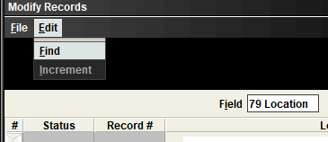

# Creating Catalog and EAD Records
{: .no_toc }
Once your finding aid has been approved by the curator, your supervisor will move the collection’s Trello card to the _Ready to Ship_ column of the _Processing Projects_ Trello. Collections need to be cataloged before they can be shipped offsite. Below are the steps to create a catalog record and to generate an EAD record. 

**If you are cataloging an addition, you should skip directly to the section on [Updating Existing Catalog Records](Creating-Catalog-and-EAD-Records.md#corrections-and-edits-to-existing-catalog-records)** 

Catalog records will appear in both [WorldCat](https://www.worldcat.org/) and the [NYPL catalog](https://www.nypl.org/research), and uploaded EAD records will appear in the [Archives Portal](http://archives.nypl.org/).

## Table of Contents
{: .no_toc .text-delta }

- TOC
{:toc}

# Initial Steps in ArchivesSpace

1\. Open the collection's resource record in ArchiveSpace.

2\. The following fields are required. Make sure they are all included and written correctly.

| FIELD NAME | DACS RULE | EAD TAGS | RDA RULE | MARC FIELDS | SUMMARY |
| ---------- | --------- | -------- | -------- | ----------- | ------- |
| Languages and Scripts of the Material | [DACS 4.5](https://saa-ts-dacs.github.io/dacs/06_part_I/05_chapter_04/05_languages_and_scripts_of_the_material.html#purpose-and-scope) | <[langmaterial](https://www.loc.gov/ead/tglib/elements/langmaterial.html)> | [RDA 6.11](https://original.rdatoolkit.org/document.php?id=rdachp6\&target=rda6-3469#rda6-3469) | [MARC 041](https://www.loc.gov/marc/bibliographic/bd041.html) | The language(s), script(s), and symbol systems employed in the materials being described. |
| Main Entry | [DACS 2.6](https://saa-ts-dacs.github.io/dacs/06_part_I/03_chapter_02/06_name_of_creators.html) | [\<origination> \<persname>](https://www.loc.gov/ead/tglib/elements/origination.html)[\<origination> \<famname>](https://www.loc.gov/ead/tglib/elements/origination.html)[\<origination> \<corpname>](https://www.loc.gov/ead/tglib/elements/origination.html) | [RDA 19.2](https://original.rdatoolkit.org/document.php?id=rdachp19\&target=rda19-393#rda19-393) | [MARC 100](https://www.loc.gov/marc/bibliographic/bd100.html) (Main entry-- personal name)[MARC 110](https://www.loc.gov/marc/bibliographic/bd110.html) (Main entry-- Corporate name) [MARC 111](https://www.loc.gov/marc/bibliographic/bd111.html)(Main entry -- meeting name) [MARC 130](https://www.loc.gov/marc/bibliographic/bd130.html)(Main entry -- uniform title) | Identifies the corporate bodies, persons, and families associated with the creation, assembly, accumulation, and/or maintenance and use of the materials being described.ASpace will automatically add the “$ecreator” relator term.  Add a relator term if the main entry is not the creator (this is uncommon).Each collection can have only ONE main entry. |
| Date | [DACS 2.4](https://saa-ts-dacs.github.io/dacs/06_part_I/03_chapter_02/04_date.html) | [\<unitdate>](https://www.loc.gov/ead/tglib/elements/unitdate.html) | [RDA 2.7.6](https://original.rdatoolkit.org/document.php?id=rdachp2\&target=rda2-6289#rda2-6289) | [MARC 264](https://www.loc.gov/marc/bibliographic/bd264.html)$c | Date or date range of materials being described. |
| Extent | [DACS 2.5](https://saa-ts-dacs.github.io/dacs/06_part_I/03_chapter_02/05_extent.html) | [\<physdesc>](https://www.loc.gov/ead/tglib/elements/physdesc.html) [\<extent>](https://www.loc.gov/ead/tglib/elements/extent.html) | [RDA 3.4](https://original.rdatoolkit.org/document.php?id=rdachp3\&target=rda3-2079#rda3-2079) | [MARC 300](https://www.loc.gov/marc/bibliographic/bd300.html) | Total collection extent, including physical and digital materials. |
| Conditions Governing Access | [DACS 4.1](https://saa-ts-dacs.github.io/dacs/06_part_I/05_chapter_04/01_conditions_governing_access.html) | [\<accessrestrict>](https://www.loc.gov/ead/tglib/elements/accessrestrict.html) | [RDA 4.4](https://original.rdatoolkit.org/document.php?id=rdachp4\&target=rda4-120#rda4-120) | [MARC 506](https://www.loc.gov/marc/bibliographic/bd506.html) | The portal automatically generates this note for each division. Optional additional notes regarding access to audio and moving image material, electronic records, and any other restrictions can be added here. |
| Abstract | Commentary to [DACS 3.1](https://saa-ts-dacs.github.io/dacs/06_part_I/04_chapter_03/01_scope_and_content.html) | [\<abstract>](https://www.loc.gov/ead/tglib/elements/abstract.html) | [RDA 7.10](https://original.rdatoolkit.org/document.php?id=rdachp7\&target=rda7-773#rda7-773) | [MARC 520](https://www.loc.gov/marc/bibliographic/bd520.html) | A brief summary overview of the collection.This can include biographical and content information. |
| Immediate Source of Acquisition | [DACS 5.2](https://saa-ts-dacs.github.io/dacs/06_part_I/06_chapter_05/02_immediate_source_of_acquisition.html) | [\<acqinfo>](https://www.loc.gov/ead/tglib/elements/acqinfo.html) | [RDA 2.19](https://original.rdatoolkit.org/document.php?id=rdachp2\&target=rda2-8636#rda2-8636) | [MARC 541](https://www.loc.gov/marc/bibliographic/bd541.html) | The source of the acquisition and the year in which it was received. |
| Reference Code/ Call number/ Identifier | [DACS 2.1](https://saa-ts-dacs.github.io/dacs/06_part_I/03_chapter_02/01_reference_code.html) | [\<unitid>](https://www.loc.gov/ead/tglib/elements/unitid.html) | [RDA 2.20](https://original.rdatoolkit.org/document.php?id=rdachp2\&target=rda2-8658#rda2-8658) | [MARC 852](https://www.loc.gov/marc/holdings/hd852.html) | If this field is missing the 949 (item records) will not export. |

3\. Verify all [Agents](https://nypl.github.io/pres-docs/archivalProcessing/Controlled_Access_Terms.html#agents) are formed correctly.

Add [relator terms](https://nypl.github.io/pres-docs/archivalProcessing/Controlled_Access_Terms.html#creatorcontributor) for [MARC 700](https://www.loc.gov/marc/bibliographic/bd700.html)/[710](https://www.loc.gov/marc/bibliographic/bd710.html) (i.e. added authors).

**Contributor (ctb)** is the most common relator term. See the [LSCH MARC Code List for Relators](https://www.loc.gov/marc/relators/relaterm.html) for more information. 

[MARC 600](https://www.loc.gov/marc/bibliographic/bd600.html)/[610](https://www.loc.gov/marc/bibliographic/bd610.html) (subjects) DO NOT need relator terms. Make sure all agents being used as subjects have been added to the agents section, not as topical subjects. 

If the Library of Congress authority record indicates an agent uses RDA rules,  add _Resource Description and Access_ in the _Rules_ field in ASpace.

If the agent is from a source other than the Library of Congress, or if the Library of Congress authority record does not indicate a name was derived using RDA rules, then leave the _Rules_ field blank as illustrated below. 

Make sure the authority identifier is entered correctly. For Library of Congress authority records, make sure to copy the number exactly as it appears in the authority record, preserving any spaces that may be present. 

4\. Verify that [Subjects](https://nypl.github.io/pres-docs/archivalProcessing/Controlled_Access_Terms.html#subjects) are formed correctly.

For complex subjects, make sure there is only one term in each field. Remember that subdivision terms each get their own field.

Also be sure that locations are labeled as _geographic_ in the _type_ field.

Make sure authorized terms are not marked as _local_, and that the _source_ and _authority ID_ are included. 

5\. Check that all containers were assigned a **container type**, **indicator**, and **barcode** in the top containers list for the collection. If the container type is omitted, terms like “box” or “tube” will be omitted in the XML.

6\. Export the MARCXML.

Go to the export menu and select _Download MARCXML_ as illustrated below.

# Converting XML to MRC in MarcEdit
Since ASpace generates the catalog information as MARCXML, you need to use MarcEdit to convert this data into a MARC format that can be imported into OCLC Connexion. 

**NOTE** 
**If you are cataloging an addition, you should skip directly to the section on 
[Updating Existing Catalog Records](Creating-Catalog-and-EAD-Records.md#corrections-and-edits-to-existing-catalog-records).**

To convert XML to MRC, follow the steps below:

1\. Open MarcEdit.

2\. Go to the File menu and select Open.

3\. A navigator window will open that only shows mrk files.

4\. In the dropdown menu at the bottom right of the menu select all files.

5\. Open the MARCXML file that was exported from ASpace.

6\. The **MARC 901** field will look like this: 

        901  \\$a---$b---

- Replace the three dashes after _&a_ with your initials
- Replace the dashes after _$b_ with: **archv**

7\. The **MARC 949** (container list) will include the following fields:
        - collection identifer (call number)
        - 5 digit location code
        - barcode
        - container type and number
  
  Each line of the container list will end like this:
        
        - $v---/---

  Replace the dashes after _$v_ with **archv**
  Replace the --- after the / with your inititials

It is recommended you do this with a find and replace.

8\. When you have finished editing the record, save it as a .mrc file. Do this by going to _file_ and _save as_, or select the compile records icon.

9\. Once you have saved your _.mrc_file you are ready to import the record into OCLC Connexion. 

# OCLC Connexion: Importing Catalog Record into WorldCat and Exporting into Sierra

**_\*NOTE: If you are cataloging an addition skip directly to the section on_** [**_Updating Existing Catalog Records_**](Creating-Catalog-and-EAD-Records.md#corrections-and-edits-to-existing-catalog-records)**_. Do not import a new MARC record into OCLC. Instead you will be editing the existing Worldcat record._**

All catalog records are published via OCLC on [Worldcat](https://www.worldcat.org/). OCLC also has extensive [documentation](https://help.oclc.org/Librarian_Toolbox) available, including information on their [Bibliographic Formats and Standards](https://www.oclc.org/bibformats/en.html) site, which includes rules for MARC fields, indicators, and subfields. Before you can catalog in OCLC you will need to request an OCLC account through ServiceNow.

1\. Log in to OCLC Connexion.

The first time you login to OCLC Connexion, or if you are logging onto OCLC Connexion for the first time on a new device or newly updated device, you will need to set up your OCLC Connexion Gateway Connection. There are [instructions 🔒](https://docs.google.com/document/d/1jHuEKAkd8eODzWFgioFsBN_lArdyln-L2t66Y5CBMj0/edit?usp=sharingkUcbRIIpfp/edit?usp=sharing\&ouid=101547597784973669792\&rtpof=true\&sd=true) available from BookOps to set up your account.

2\. Import the .mrc file. 

Go to the File menu and select Import Records.

Navigate to your saved .mrc file, and check the _Import to Online Save File_ radio button.

When the dialogue box asks _Do you want to delete your original import file?_ select _No_.

3\. Locate and open the newly imported file.

Go to _Cataloging > Search > Online Save File,_ and search for the collection by title.

4\. When the new record opens, validate it to check for errors.

Select _Edit > Validate_ or the green check icon to identify errors in the record.

There will be no message if there are no errors.

Select _Edit > Reformat or the _R_ icon to organize the order of the record’s fields.

5\. Correct errors if any are indicated after validation. 

## Common OCLC Connexion Errors

**ELvl (Leader/17) Error**

This [error](https://help.oclc.org/Metadata_Services/WorldShare_Record_Manager/Troubleshooting/Why_am_I_receiving_the_error_%22ELvl_(Leader%2F%2F17)_-_invalid_code%22_or_%22ELvl_(Leader%2F%2F17)_-_not_authorized_to_use_I%22_when_I_try_to_validate_a_record%3F) is very common the first time you attempt to validate a newly imported record. You will likely get an error similar to the one depicted below.

This occurs when there is a  _I_ or _J_ in the _ELvl_ field at the top of the record. To correct the error, simply delete the letter from the box as illustrated below. 

See OCLC's [documentation](https://help.oclc.org/Metadata_Services/WorldShare_Record_Manager/Troubleshooting/Why_am_I_receiving_the_error_%22ELvl_(Leader%2F%2F17)_-_invalid_code%22_or_%22ELvl_(Leader%2F%2F17)_-_not_authorized_to_use_I%22_when_I_try_to_validate_a_record%3F) for further information

**Diacritics**

You need to add diacritics manually in OCLC. 

Place the cursor after the letter that the diacritic will modify, and navigate to _Edit_ > _Enter Diacritics._

A menu of diacritics will open. You can select the correct language from the dropdown menu, which will show the most common diacritics for that language. 

Choose the correct diacritic, and then select _insert and close._

**Dates**

If the whole collection contains only a _single date_, not inclusive dates, change the **_DtSt_** field at the top from **_i_** for _inclusive dates_ to **s** for _single date_.

**Meeting Names** 

[MARC 611](https://www.oclc.org/bibformats/en/6xx/611.html) (e.g. names of conferences, festivals, etc.)

These are entered into ASpace as corporate names and will output into the MARC record as a [MARC 610](https://www.oclc.org/bibformats/en/6xx/610.html) field. Change the field to a [MARC 611](https://www.oclc.org/bibformats/en/6xx/611.html). 

**245 Field Error**

If you are cataloging an artificial collection that does not have a _main entry_, you will get an error message about the _Title Statement_ \[[MARC 245](https://www.oclc.org/bibformats/en/2xx/245.html)] field. 

Change the first indicator in the 245 field from a 1 to a 0. This indicates that there is no added entry for the title field, and will allow the record to validate.

**910 Field**

All materials cataloged for the Research Libraries must include a 910 field. Make sure this field is included. This field is automatically generated by ArchivesSpace in the MARCXML export.

6\. Control Name and Subject Terms.

Select _Edit > Control Headings > All._

The controlled  headings will turn blue. [**AAT**](https://www.getty.edu/research/tools/vocabularies/aat/) **genre terms** \[[MARC 655](https://www.oclc.org/bibformats/en/6xx/655.html)] and [**ITOAMC**](https://folgerpedia.folger.edu/Index_terms_for_occupations_in_archival_and_manuscript_collections_\(ITOAMC\)) **occupation terms** \[[MARC 656](https://www.oclc.org/bibformats/en/6xx/656.html)] never link and do not need to be controlled. 

**_Local_** agents and subjects also cannot be controlled.

The **Main Entry** \[[MARC 100](https://www.oclc.org/bibformats/en/1xx/100.html) and [MARC 110](https://www.oclc.org/bibformats/en/1xx/110.html0.html)]  field frequently does not automatically link, and will need to be controlled manually if it has an existing authority heading. 

**Added entries** \[[MARC 700](https://www.oclc.org/bibformats/en/7xx/700.html) and [MARC 710](https://www.oclc.org/bibformats/en/7xx/710.html)] fields may also need to be controlled  manually.

If an authorized agent or subject did not link, right click on it and select **_Control single heading_**. 

Sometimes a new window will open with a suggested heading. You can click on the linked heading in the pop up window for more information. 

[suggested heading](/Images/146-suggested-heading.png)

If the heading is correct, choose **Insert heading** to link it in your record. 

If there is no authority record for the heading, double check that the heading is formed correctly. Change the term in OCLC and ArchivesSpace if it was formed incorrectly. Often a term will not validate if the wrong source or identifier was chosen in ASpace.

7\. When you have finished editing, _validate_  and _reorder_ the record again.

8\. If the record is valid Select _Action > Holdings > Update holdings_, which will publish the record in WorldCat.

9\. Then select _Action > Export_, which __exports the record to Sierra.

# Sierra: Final Edits
If you have created a brand new catalog record, these final steps in Sierra will be to verify your catalog record exported correctly, to record the bnumber in ArchivesSpace and SPEC, and sometimes to edit the location information or suppress certain items. There is a NYPL [Sierra Manual 🔒](https://sites.google.com/a/nypl.org/sierramanual/nypl-sierra-manual) available that goes into more detail about Sierra’s functionality and navigation. 

**Remember that if you are cataloging an addition or editing an existing catalog record, you should skip directly to the section on [Updating Existing Catalog Records](/Creating-Catalog-and-EAD-Records.md#corrections-and-edits-to-existing-catalog-records).**

Open the Sierra desktop app and login to Sierra. Navigate to the collection’s catalog record to make sure the record was exported correctly.

## Collection Locations
Make sure the collection location is correct. ArchivesSpace automatically assigns the most common location by division and container size. See the internal [Cataloging Archival Collections 🔒](https://docs.google.com/document/d/1XMCuaNAQwFyRw-UMd86Me8R0YMDczk_S14sjhEEJ2AY/edit?usp=sharing) documentation for location codes and access notes. 

If you need to change a location, select the specific item(s) that need to be changed in the summary view of the record.

Then select _Edit_ > _Modify Group_

Make sure _location_ (79) is selected in the _Field_ box. You can change the field by clicking in the box.

If you need to edit the _location (79)_ of multiple items, select _edit > find_

Then use the find and replace function to make the changes. 

A list of [location codes 🔒](https://docs.google.com/document/d/17iNW_ekPo6TrNT0ir4LLsDZJLAmV3d5-cF0p3gsi8WA/edit) is also available on the BookOps Lair page.

## Item Agency Codes
If you change the location, you will also need to change the _item agency (127)_ using the same process.
A list of item agency codes is available in the internal [Cataloging Archival Collections 🔒](https://docs.google.com/document/d/1XMCuaNAQwFyRw-UMd86Me8R0YMDczk_S14sjhEEJ2AY/edit?usp=sharing) documentation.

## Locating the bnumber
When the catalog record is complete, locate the bnumber. The bnumber is the letter “b” followed by eight numbers at the top of the record. When recording the bnumber, omit the last digit. This number must be added to both the collection’s ASpace record in the _bnumber_ _indentifer_ field and the bnumber field of the SPEC collection record. 

When you have finished cataloging the collection, mark the cataloging task in the collection’s Trello card as complete. See the [Updating Trello]() section of this documention for more information on managing projects in Trello.

# Corrections and Edits to Existing Catalog Records
If you are cataloging an addition to a previously processed collection, or if you are editing an existing catalog record or finding aid, follow the steps below. You will not need to export the MARCXML from ASpace, import the MARC record into OCLC, or export the record from OCLC to Sierra. 

## Updating Records in OCLC Connexion
1\. Open OCLC Connexion and go to _Cataloging_ > _Search_ > _WorldCat_.

2\. Search for the collection by title.

3\. Open the collection record and make edits to the record. Some common updates are:

| **Field Name** | | **MARC Field** |
| --------------- | --------------- |
| Extent | [MARC 300](https://www.oclc.org/bibformats/en/3xx/300.html) |
| Dates | [MARC 264](https://www.oclc.org/bibformats/en/2xx/264.html) |
| Arrangement | [MARC 351](https://www.oclc.org/bibformats/en/3xx/351.html) |
| Conditions Governing Access | [MARC 506](https://www.oclc.org/bibformats/en/5xx/506.html) |
| Abstract | [MARC 520](https://www.oclc.org/bibformats/en/5xx/520.html) |
| Immediate Source of Acquisition | [MARC 541](https://www.oclc.org/bibformats/en/5xx/541.htmlml) |

**_Make sure you also make these same changes in ASpace_**

OCLC does not store local fields or item records \[[MARC 949](https://www.oclc.org/bibformats/en/9xx/945-949.html)], so these do not need to be updated.

4\. Once all changes have been made, validate the record.

5\. If the record is valid, Select _Action_ > _Replace Record_. This will make your changes appear in WorldCat.

## Updating Catalog Records in Sierra
Once you have updated the OCLC record in Worldcat, you will need to make the same updates in Sierra, and add the new containers and their locations.

1\. Login to Sierra and open the record.

2\. Select _edit_ and make the same changes you made to the WorldCat record in OCLC Connexion.

3\. Once you have completed the edits, select _save_. The changes will be immediately changed in the OPAC. 

### Adding Item Records in Sierra
Once you have updated the various fields of the catalog record in both OCLC and Sierra, you will need to add the new containers to the catalog record. In Sierra these are called item records. You can add a single item record or add many item records in bulk. 

If you are cataloging an addition or adding multiple containers to a collection, skip to the section for [Adding Multiple Item Records to A Sierra Catalog Record](/Creating-Catalog-and-EAD-Records.md#adding-multiple-item-records-to-a-sierra-catalog-record).

### Adding A Single Item Record to Sierra Catalog Record
To add a single item record to a Sierra catalog record complete the following steps:

1\.Go to the _Summary_ view.

2\. Make sure _i Item_  is selected in the _View_ dropdown menu.

3\. Select the _Attach New Item_ button on the right.

4\. Make sure the _single item_ radio button is selected and follow the prompts.

- **Location**: Use the [code 🔒](https://docs.google.com/document/d/1XMCuaNAQwFyRw-UMd86Me8R0YMDczk_S14sjhEEJ2AY/edit?tab=t.0#heading=h.zgrvqj3x9y2v) according to the collection’s division.

- **Item Agency**: Choose the item agency [code 🔒](https://docs.google.com/document/d/1XMCuaNAQwFyRw-UMd86Me8R0YMDczk_S14sjhEEJ2AY/edit?tab=t.0#heading=h.mvaigk386hqz) based on the division and it's storage location.

- **Item Type**: This will almost always be _archival materials_.

- **OPAC Message**: Use the [correct message 🔒](https://docs.google.com/document/d/1XMCuaNAQwFyRw-UMd86Me8R0YMDczk_S14sjhEEJ2AY/edit?tab=t.0#heading=h.v34n8gwdu3d4) based on each division's local conventions. 

- **Item Message**: Use the [correct message 🔒](https://docs.google.com/document/d/1XMCuaNAQwFyRw-UMd86Me8R0YMDczk_S14sjhEEJ2AY/edit?tab=t.0#heading=h.v34n8gwdu3d4) based on each division's local conventions. 

- **Call Number**: Use the collection's Call Number.

- **Barcode**: Enter the new item's barcode.

- **Unit/Initials**: Enter your initials and your division as explained in the [internal documentation 🔒](https://docs.google.com/document/d/1XMCuaNAQwFyRw-UMd86Me8R0YMDczk_S14sjhEEJ2AY/edit?tab=t.0#heading=h.4x0ulc59m4nd).

5\. The new item will not be created until you save the record. Once you save the record, the updates will appear in the OPAC.

### Adding Multiple Item Records to A Sierra Catalog Record
To add a multiple item records to a Sierra catalog record complete the steps below. The first time you do this, you will need to [configure 🔒](https://docs.google.com/document/d/1XMCuaNAQwFyRw-UMd86Me8R0YMDczk_S14sjhEEJ2AY/edit?tab=t.0#heading=h.ssa59pf6klqh) your settings in Sierra.

1\. In the summary screen, select _Attach new item_. 

2\. Select the radio button for Multiple items. 

3\. If you add the first barcode of the materials you are cataloging to the _beginning barcode_ files, the system will automatically generate the subsequent barcode numbers. If the barcodes you used were not sequential, **do not enter a barcode here**, you can add them manually to the item records later.

4\. For the _Volume Caption field_, enter the container name. Add a space after the container name. (e.g. _box_  or _volume_).

5\. Enter the first container in the _first volume field._

6\. Add the last container number in the _last volume field._

7\. Enter _1_ in the _Beginning Copy Number_ field. 

8\. Leave the box next to _Increment copy number_ checked.

9\. For the _location_, enter the correct division [location code 🔒](https://docs.google.com/document/d/1XMCuaNAQwFyRw-UMd86Me8R0YMDczk_S14sjhEEJ2AY/edit?tab=t.0#heading=h.zgrvqj3x9y2v).

10\.  For # of Copies, enter 1.

11\.  After pressing _okay_, you will be prompted with a list of the new item records and asked to confirm that you want to create them. 

12\. Click _yes_ to create the items.

13\. Fill out the fields when prompted, which will be as follows:

- **Item Type**: This will almost always be _archival materials_.

- **Call Number**: Use the collection's Call Number.

- **Barcode**: Barcode for first item being added. You can also leave this blank and add it later.

- **Volume**: container number for first item being added.

14\. Once you have filled in all the fields, go to the _Summary_ screen to see that the new items have been created. 

12\. Once you select _Save all_, the item records will be created and will appear in the OPAC. Make sure you add the barcodes before closing the record, and remember that items can be edited or deleted at any point if you notice any errors or make any mistakes.

### Adding Barcodes to New Item Records

1\. In the summary screen select all the item records you want to update.

2\. Go to the edit menu on the top, and select _modify group_.

3\.Click on the field box and select _barcode_ from the menu that pops up.

4\. Scan or enter in the barcodes for each item.

5\. When you have finished entering the barcodes, select _save_ at the top right. This will save the barcodes in Sierra and in the OPAC.

# Creating EAD Records and Editing in Oxygen
Once you have finished cataloging a collection, the final step is to create an EAD record, which will be uploaded by your manager to [the archives portal](https://archives.nypl.org/) in order to publish your finding aid. The Archival Processing unit currently uses the [EAD 2002](https://www.loc.gov/ead/tglib/element_index.html) standard. For more information on encoded standards, see the resources from the Society of American Archivists’ [Technical Subcommittee on Encoded Archival Standards](https://saa-sdt.github.io/EAS-Best-Practices/) (TS-EAS). ****Follow the instructions below to finalize your collection’s EAD. 

1\. Before exporting the collection's EAD, make sure to first add the bnumber to the collection’s SPEC and ASpace records. 

2\. In SPEC, navigate to the collection record and select the edit icon. Add the bnumber to the _catalog bnumber_ field.

3\. Go back to your collection’s ArchivesSpace record and add the bnumber as an _identifier_.

4\. Go to the _Export_ menu and select _Download EAD._

5\. Open the downloaded file in Oxygen XML Editor.

6\. Select the _format and indent_ to make the file more readable. 

7\. Select _validate_ to make sure the EAD is valid.

8\. Review the EAD to make sure the correct EAD tags were used, and that the record is valid. Correct any errors indicated by the Oxygen validator.

9\. Double check that any special characters and diacritics are displaying correctly. If you did not paste the character into ASpace as plain text from a stable source, then extra spaces might appear between the letter and the character. If this happens, fix the text in ASpace first, and re-export the EAD. If the collection includes diacritics or characters that are causing errors, check with your supervisor to troubleshoot the issue.

10\. Once the record is valid, save the file, and update the collection’s trello card checklist, and attach the XML file to the trello card. After the collection has shipped, your manager will upload the EAD to the [Archives Portal](https://archives.nypl.org/) to publish your finding aid.