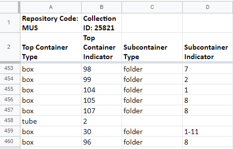

# Entering Data Into The ArchivesSpace Processing Spreadsheet
When working within the [ArchivesSpace Processing Spreadsheet Template](https://docs.google.com/spreadsheets/d/1TEPAgzKzb5C8IWVkRfHy2--Wj4sMdM6XitKM4ZZiesg/edit#gid=0), there are a few key guidelines to keep in mind:

**Top Container Type**

Each container in a collection must have a _Top Container Type_ (box, tube, volume, or oversize_folder) and a _Top Container Indicator_ (the container number). 

**Types of Containers**

There are four types of containers: _box_, _tube_, _oversized folder_, and _volume_. Some legacy collections may also include containers called _reel_ and _folder_. For more information on working with legacy collections, see the section of this manual on [Additions and Legacy Finding Aids](). Electronic records and audio and moving image items are imported via an exported report and entered as _Identifiers_. However, electronic records (er), may still be entered as a container type in the spreadsheet. 

**Numbering Containers**

When processing various container types, the numbering scheme always restarts at 1. For example, after processing a box numbered 44 and moving onto items in tubes, the number of the tubes will begin again with 1. 

**Subcontainer Type**

If a box contains folders, it must include the _Subcontainer Type_ (folder) and the _Subcontainer Indicator_ (folder number).

_Tube_, _volume_, and _oversized folder_ _Top Container Types_ will never have a _subcontainer type_.

**Dates**

A date that is also the folder title must be entered into the _dates_ field. The folder title fields (i.e. _c01, c02,_ etc) should be left blank. Consecutive dates should be entered as a range, while dates with large gaps should be separated with a comma. If you cannot determine a date, leave the field blank or use an estimated date with _circa_ as the prefix.

**Title Tags**

\<title> tags can be included in the spreadsheet when applicable.

**Container Ranges**

The ASpace importer will recognize a contiguous container range entered into the processing spreadsheet, such as box “1-3”, and create three separate container instances in the top container list. However, each noncontiguous _top container type_ in a single component must be entered as a single _top container indicator_. If you have a component with noncontiguous containers, or if you wish to display the folder ranges for each box, you must create a separate line for each top container (as illustrated in the example below). When working in the spreadsheet, repetition is okay, because containers can be manually consolidated once they have been imported in ASpace.

**Subcontainer Indicators**

_Subcontainer indicators_ for the folders located inside boxes will typically be entered as a range. See the section of this manual on [Archival Description ]()for detailed information about working with and revising top containers in ASpace. See the example below for how to properly enter box ranges.

**Call Number Field**

If the materials in your collection include a numbering or labeling system imposed by the creator or donor which may be helpful to the researcher, this unique identifier should be recorded in the _call number_ field (EAD: \<unitid type="local\_call">) of each applicable component. 

For more insight on data entry into ArchivesSpace, refer to the section of this manual on [Archival Description]().

