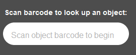

# **Location Management in the Archival Processing Unit**
You must update the physical locations of all containers in your collection during processing. Collection Management monitors and manages all storage locations, but it is the responsibility of the processing archivist to make sure each object’s location is up to date in SPEC. Most shelves and rooms at LSC have location barcodes that can be scanned directly into SPEC. Archivists should keep a copy of their workspace room’s barcode at their desks. When you bring collection containers from the stacks to your desk, you must update the location in SPEC, and you must do the same for processed materials being stored in the stacks or at your workspace prior to shipment. Collection Management also has [documentation]() that outlines procedures for location management at LSC. 

The chart below details all the times you need to update collection location information in SPEC:

| Scenario | Action in SPEC |
| ---------| ---------------|
| Collection moved from stacks to workspace for survey and/or processing. | Update objects’ location in SPEC with your workspace barcode or current location. |
| Collection returned to stacks after survey for storage. | Update objects’ location in SPEC with stacks shelf location. |
| Collection rehoused into new containers. | [Deactivate]() the old containers in SPEC. |
| New containers imported from ASpace into SPEC. | Update the locations of all newly imported objects in SPEC. |
| Processed containers moved to stacks for temporary storage. | Update all containers in SPEC with their current room, shelf, or mapcase location. |

Below are instructions on how to update locations using the Object Barcode App and from the Object Search screens in SPEC. The [SPEC Objects Manual]() also has detailed instructions on how to perform all these tasks, as well as a section about [location]() management.

## **Updating Locations Using the SPEC Object Barcode App**
From the SPEC landing page navigate to the Object Barcode App under the Object menu.

On the _Object Barcode App_ screen, scan in the barcode of the object whose location you need to update.

The object name, type, and current location will appear. Scan the new location barcode into the _Location Barcode_ field on the right.

A message will pop up notifying you that a different object barcode than the current active location has been entered. Select _OK_. 

This will make the previous location inactive, and update the location to the new one you scanned. The new location will be reflected under _Active Storage Location_.

Repeat these steps for each location you need to change. If you have to update many locations, it is recommended that you use the _Object Search_ or _Batch Object Editor_ functions in SPEC.

