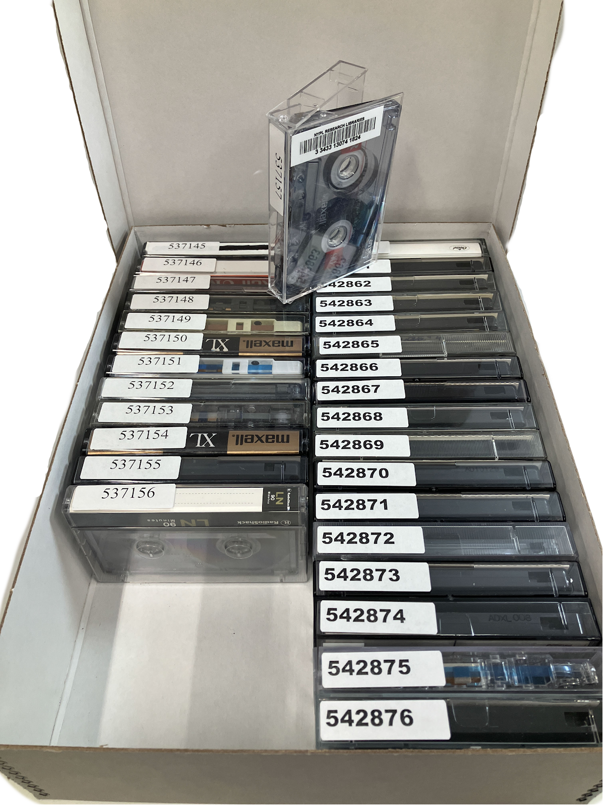

# **Media Originals**
At NYPL, a single AMI item is called a Media Original. AMI is stored by format in division-specific media originals boxes. Below is information on how to properly store AMI in media originals boxes. A general guiding principle is that the _AMI ID_ numbers should be visible when looking into the box. Once a media originals box is full, apply a barcode to the box and scan the barcode into the object record for that box in the Media Originals collection for the correct curatorial division in SPEC. See the section of this documentation about [barcode placement]() for information on how to barcode each box type.

## **Media Originals Boxes**
Below is information on how to properly store audio and moving image items in media originals boxes. A general guiding principle is that the AMI ID numbers are visible when looking into the box. Once a media originals box is full, apply a barcode to the box and scan the barcode into the object record for that box in the Media Originals collection for the correct curatorial division in SPEC. The media originals collection number for each division is listed in the Creating New Media Originals Boxes section of this documentation. Consult with your manager to inditify the correct boxes for your collection. See the section of this documentation about barcode placement for information on how to barcode each box type.

### Audio Reels 
Stand on edge in record cartons 

### Audio Cassettes 
On long edge in cassette boxes. Cassette boxes are then stacked three to a record carton. 

### Small Video Cassettes (hi-8 and other small formats)
On long edge in cassette boxes. Cassette boxes are then stacked three to a record carton.

### Large Video Cassettes (U-matic/Beta)
With long edge greater than nine inches should be stored on long edge in record cartons. Place the identifier labels where they are visible when looking into the record carton.

This example shows beta tapes that fit on the short edge with labels on the top of the cassette (left and right) as well as longer cassettes (center) with labels on the spine.

### Video Cassettes (VHS) 
On the short edge standing in record cartons.

### Video Reels
Stand on edge in record cartons.

### Film 
Cans lie flat in record cartons, or on a shelf if they are too large. 

Films that are too large to fit in a media originals box will be treated as a unique media original item. The film canister should be labeled with a media original label, identifier number, and barcode. 

### Discs (Grooved Media) 
Should be stored on edge in upright disc boxes. Do not mix different sizes in the same box.

### CD / DVD
Should stand on edge in CD/DVD boxes.

## Creating New Media Originals Boxes
If there are no available Media Originals boxes for the format you are inventorying, or if you fill up an existing box, a new Media Originals box must be created in SPEC. Detailed instructions can also be found in section 4.5.3 [Create New Media Originals]() of the Audio and Moving Image Inventory and Other Processes in SPEC manual.