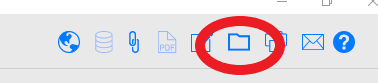

# Preliminary Background Work
{: .no_toc }
Before processing can begin, you must first complete a [processing proposal](/Processing_Proposal.mds) and submit it to your supervisor for approval. The [processing proposal template](https://docs.google.com/document/d/1xhqvV--epavz3_AWj0-AzC7887KnpnYEpMchYS0tbL4/edit?usp=sharing/1alJwnEJwI7oKZ_TqZas_TvMV3xN_rndl/edit?usp=sharing\&ouid=108219624496366593981\&rtpof=true\&sd=trueuDiqD3R2Y/edit?usp=sharing\&ouid=108219624496366593981\&rtpof=true\&sd=true) is a Google Doc in Google Drive. Samples of completed plans can be found in the Acquistion Folders of processed collections. 

When a new collection is assigned to an archivist, the first step is to gather all the relevant documentation, and to perform some background research on the collection. You should view the acquisition information in [SPEC](spec/spec.md) and the dossier or acquisition folder in Google Drive. If the collection is an addition or is material separated from an existing collection, you should also review the original finding aid in the [archives portal](http://archives.nypl.org/).

## Table of Contents
{: .no_toc .text-delta }

- TOC
{:toc}

## Dossiers and Acquisition Folders
Dossiers and Acquisition folders include all documentation compiled and created during the acquisition process. This may include such documents as inventories by the donor or seller, correspondence between sellers/donors and curators, purchase agreements, deed of gift, site visit reports, collection photographs, appraisal records, creator background information compiled by the curator, accessioning notes, and details on restricted or sensitive materials.

Collection dossiers are arranged into folders by curatorial division, and sorted by collection number. Acquisitions prior to July 2021 will have dossiers in Google Drive. Dossier folders typically use the following format: _Unique Identifier\_Collection Title_. Some legacy collections may not have acquisition information or collection dossiers.

Acquisition information for collections received after July 2021 are located in the SPEC record, and additional documentation is located in the acquisition folder in Google Drive. Acquisition folders use the following format: _Acquisition Number\_Acquisition Name_. You can navigate to a collection’s acquisition record directly from the SPEC acquisition record by selecting the folder icon in the top right. All completed [processing proposals](/Processing_Proposal.md) and closing memos should also be added to the acquisition folder. 

## Related Collections
Check if there are related collections at NYPL or another archival repository. Review any existing finding aids for similar collections. If the collection is an addition, locate the finding aid for the previous accruals in the [archives portal](http://archives.nypl.org/), and check with your supervisor if the new materials should be integrated into the existing finding aid, or described in a new finding aid.

Also, be sure to check the [library catalog](https://www.nypl.org/research/research-catalog/) to see if the collection has a catalog record, and if portions of the collection such as scrapbooks or photographs were previously digitized or separated. You should also check Sierra to see if related collection material was previously cataloged and suppressed.

## Conducting Additional Background Research
Before you begin work on your [processing proposal](/Processing_Proposal.md), you should spend some time conducting general background research on the collection’s creators and contributors, as well as the events, locations, institutions, time periods, and organizations that the collection documents. This background information will allow you to better contextualize the collection within the library’s larger holdings, and to gain an understanding of the rationale for the acquisition. During this research you should consider your own background, biases, and positionality, and how they may impact the way in which you arrange and describe the collection. It is important to recognize the limits of your own knowledge, and to never attempt to be the expert or authority on another person’s experience.[^1]

Since we process collections from a variety of research divisions, the archivists in the Archival Processing unit often acquire specialized knowledge through this work, and encounter resources that may be useful to others. We have created a [resource document](https://docs.google.com/spreadsheets/d/1IALH_cfVpQqFGuezhwXk8GIFglJqinsXqw3lRtqp9RQ/edit#gid=0) to collect recommendations for conducting background research and verifying facts. This is a collaborative document that can be updated and edited by all staff in creating archival description. Compiling these research resources in a central place will prevent us from repeating the work that our colleagues have already done in locating reliable and accurate sources. 

[^1]: Jessica Tai suggests that archivists should “normalize not knowing” and “accept the limitations in serving as the authoritative voice on another’s experience.” Jessica Tai, “Cultural Humility as a Framework for Anti-Oppressive Archival Description,” _Journal of Critical Library and Information Studies_ 3 (October 1, 2020): 3, 6, <https://journals.litwinbooks.com/index.php/jclis/article/view/120>.