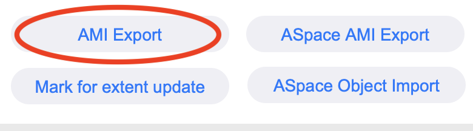
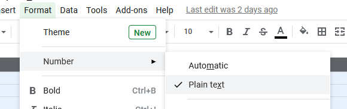

# Processing Audio and Moving Image Material
{: .no_toc }
The arrangement and description of audio and moving image (AMI) material utilizes many of the same guiding principles as other archival materials, but involves additional steps because AMI is described on the item level to facilitate digitization for long-term preservation and access. This section details the tasks and special considerations that are necessary when working with AMI in archival collections, and addresses identification, inventory, and housing of these materials. The Media Preservation Services department facilitates and coordinates the preservation and digitization of AMI. See the [Media Preservation Documentation Portal](https://nypl.github.io/ami-preservation/) for further information about the ways in which media is digitized and preserved. 

## Table of Contents
 {: .no_toc .text-delta }
- TOC
{:toc}

# Identification of Audio and Moving Image Content
There are many resources that can aid in identifying the audio and moving image materials in a collection. Some helpful identification resources are listed below. If you are unable to identify any of the media in your collection, talk to your supervisor and contact the Manager of Audio and Moving Image Description.

**All Formats**

[University of Illinois Preservation Self-Assessment Program](https://psap.library.illinois.edu/collection-id-guide/#audiovisual) is a helpful guide for identifying most common audio and moving image formats.

The [National Archives](https://www.archives.gov/preservation/formats) preservation site has a section on archival formats, which includes sections for [audio](https://www.archives.gov/preservation/formats/audio-toc.html), [video](https://www.archives.gov/preservation/formats/video-toc.html), and [film](https://www.archives.gov/preservation/formats/motion-picture-film-toc.html). [The Museum of Obsolete Media](https://obsoletemedia.org/) is helpful if you encounter less common or rare audio and moving image formats.

**Video**

The Texas Commission on the Arts [Videotape Identification and Assessment Guide](https://www.arts.texas.gov/wp-content/uploads/2012/04/video.pdf) is a useful resource for information about all video tape formats.

**Film** 

Brian Pritchard’s site has a [guide](http://www.brianpritchard.com/IMPF.htm) to identifying both [16mm](http://www.brianpritchard.com/16mm%20Identification%20Version%201.02.pdf) and [35mm](http://www.brianpritchard.com/35mm%20Film%20Identification%20Version%203.2.pdf) film.

The National Film and Sound Archive of Australia has a [short technical guide](https://www.nfsa.gov.au/preservation/guide/handbook/identification) to film types.

**Preservation Issues**

Often AMI with preservation issues is discovered during accessioning, and physically separated from the collection. Collection Management will assess the preservation concerns and determine whether the materials will need to be sent to a vendor for remediation. However, you still may encounter additional AMI content with preservation issues during your appraisal or inventory. Some common issues are mold and film with vinegar syndrome. The [filmcare.org](https://filmcare.org/visual_decay) site is a useful resource in helping to identify potential preservation issues. If you are unsure if something is an AMI preservation issue, reach out to Collection Management for guidance.

# AMI Inventory and Description
AMI in archival collections are accessioned on an item level by Collection mMnagement when a new acquisition is received, or when a backlog collection is shipped to the Archival Processing unit for processing. Each piece of media is labeled with a barcode and a unique AMI identifier generated in SPEC. Collection Management will also update SPEC with the format of each object. 

For acquisitions received in 2023 to the present, the AMI inventory will be attached to the acquisition record. Older collections may have a preliminary inventory with bibliographic data attached to the collection record. 

In the Archival Processing unit, the inventory of AMI in archival collections is performed by exporting a spreadsheet of the initial Collection Management inventory and enhancing it with DACS-compliant descriptive data, including titles, dates, and tracklists. 

During the inventory, if you encounter incorrect formats, you should correct the record in SPEC. 

If you encounter AMI that is not inventoried, or electronic records that mistakenly inventoried as AMI, contact Collection Management. They will make arrangements to review the media and create or correct the records in SPEC.

The inventory the you export and create in a spreadsheet will be imported into ArchivesSpace. See the section on [Importing an Audio and Moving Image Inventory](/Processing_AMI.md#importing-an-ami-inventory-into-archivesspace) into ArchivesSpace for instructions on how to do this.

## Moving a SPEC AMI Inventory to the SPEC Collection Record
Before you begin processing any AMI, your first step is to move the inventory into the acquisition’s associated collection record. To do this follow the steps below:

1\. Navigate to the acquisition record and select the inventory icon.
 

2\. When the inventory opens, filter the SPEC objects list just for AMI.

3\. Select the _bulk action_ menu.

4\. Choose _select all_ from the _Action_ menu. This will check the boxes for each AMI object.

5\. Select the _Action_ menu again, and this time choose _add to collection_.

6\. A warning dialog box will open, select _OK_.

7\. Search for the collection in the pop up box, and then choose the blue _select_ button next from the list.

8\. SPEC will then perform an operation to associate all the AMI with the collection record. This may take a few minutes. 

9\. Once this is complete, navigate to the collection record, and you should see all the new associated objects in the content summary. 

## Inventory Export
To create an inventory of the AMI for ArchivesSpace you will need to export an inventory spreadsheet from the SPEC collection record. This step should only occur in the collection record after all AMI objects have been associated with the collection record. Do not export AMI from the Acquisition record.

There are two types of exports, the _AMI Export_, which is a full csv export with fields you will not ultimately import into ASpace, or the _AMI ASpace export_, which exports ONLY the fields that can be imported in ASpace.

## SPEC AMI Export 
For larger collections, it is generally best to export this full AMI object list that includes additional metadata to help identify and keep track of content. This export is called _AMI Export_ and is the button on the left. 

The section below details each field in the SPEC AMI Export and it's corresponding field in the [ASpace AMI Export](/Processing_AMI.md#spec-aspace-ami-export)

### SPEC AMI Export Fields

| **Field Name** | **CSV Column** | **ASpace Export Column** | **Description** |
| ---------- | ---------- | ----------- |
| barcode | A | n/a | Barcode of the media object. You can scan the barcode to search fro it in the spreadsheet. |
| ref_ami_id | B | A | AMI Identifer. Unique identifer automatically assigned by SPEC. **This field is required**. |
| division | C | B | Division Code | The three letter division acronym (i.e. SCL, MUS, MSS). This will be pre-populated. **This field is required**. |
| ref_collection_id | D | C | Collection ID. The unique identifier assigned by SPEC. This field will be pre-populated. 
**This field is required**. |
| id_label_text | E | D | Title. The title of the media. |
| date | F | E | The date of the recording. This must be formatted according to [DACS 2.4](https://saa-ts-dacs.github.io/dacs/06_part_I/03_chapter_02/04_date.html_I/03_chapter_02/04_date.md). If the item is undated, leave this field blank. |
| id.classmark | G | F | Classmark. This field is used for unique identifiers assigned by the division. This field is more common in legacy collections. |
| id.legacy | H | G | Collection-Specific Identifier. A unique identifier assigned by the collection creator or donor. |
| notes.content | I | H | Scope and Content. Any additional information about the content that is not in the title field should be here. Tracklists will import as block text. You will need to manually change this data into ordered lists. See the ArchivesSpace documentation for instructions on how to do this. If you are working on legacy collections that have data in a general notes field in SPEC, you will need to manually copy this data into this field if you wish to retain it. |
| format_1 | J | I | Content format. This will always be Sound Recording, Video, or Film. This field is pre-populated. |
| group | K | J | Series. This field is used to arrange inventoried items into topics assigned by the archivist. Items in the same group will import together under a single component title. Assigning consistent group names will help you keep the inventory organized. |
| sequence | L | K | Sequence. Used to identify sequential media, such as a single interview recorded onto two audio cassettes. |
| notes | M | This is a general notes field that is sometimes populated in legacy collections. |
| notes.preservation | N | [Technical notes](https://nypl.github.io/pres-docs/audioMovingImage/preservation-notes.html) about the media. |
| dtentered | O | The date that the media was inventoried in SPEC. |
| account.entered | P | The account name of the person who inventoried the media object. |
| ux_loc_active_d | Q | The storage location of the media. |
| name_d_calc | R | The container where the media is housed. |
| id_barcode | S | The barcode of the container housing the media. |
| format_2 | T | The format of the original media. |
| format_3 | U | The more specific format type of the original media. | 
| manufacturer | V | The manufacturer of the original media. |
| generation | W | Indicates if the media is an original or a copy. |

Follow the steps below to complete this export.

1\. Navigate to the collection record select the collection objects from the _AMI Export_ button on the left

2\. This will generate a csv that will download to your desktop.

3\. A dialog box will pop up when the export is finished.

4\. It is recommended that you upload the csv to google drive and open it in google sheets before starting your inventory work. Excel sometimes adds special characters or formatting that can lead to data loss. 

## SPEC ASpace AMI Export 
If you have a small collection, you may choose to just export the basic AMI inventory using the _AMI ASpace Export_ button. This creates a spreadsheet in the format required for import into ASpace, and includes only the fields that will import. 

The _AMI ASpace Export_ button is also located on the left hand side of a SPEC collection record, just to the right of the _AMI Export_ button 

When you select this button, a spreadsheet of all the AMI objects will automatically export to your desktop. This spreadsheet will export without column labels. It is recommended that you temporarily add labels before resuming inventory work. 

The fields that will import into ASpace are listed below. When you import your inventory into ASpace, it must mactch exactly to the ASpace export coloumns. The chart below also details which column the data maps to in the _SPEC AMI Export_. The _ASpace AMI Export_ does not include headers, and if you add your own as a placeholder, you have to delete them before import.

### SPEC ASpace AMI Export Fields
| **ASpace Export Column** | **Field Name** | **SPEC AMI Export column**| **Description** |
| - |--------------- | - | ----------------|
| A | AMI Identifier | B | Unique identifier automatically assigned by SPEC. This field will be pre-populated. **This field is required**. |
| B | Division Code  C | The three letter division acronym (i.e. SCL, MUS, MSS). This will be pre-populated. **This field is required**. |
| C | Collection ID | D | The unique identifier assigned by SPEC. This field will be pre-populated. **This field is required**. |
| D | Title | E | The title of the media. |
| E | Date | F | The date of the recording. This must be formatted according to [DACS 2.4](https://saa-ts-dacs.github.io/dacs/06_part_I/03_chapter_02/04_date.html_I/03_chapter_02/04_date.md). If the item is undated, leave this field blank. |
| F | Classmark | G | This field is used for unique identifiers assigned by the division. This field is more common in legacy collections. |
| G | Collection-Specific Identifier | H | A unique identifier assigned by the collection creator or donor. |
| H | Scope and Content | I | Any additional information about the content that is not in the title field should be here. Tracklists will import as block text. You will need to manually change this data into ordered lists. See the ArchivesSpace documentation for instructions on how to do this. If you are working on legacy collections that have data in a general notes field in SPEC, you will need to manually copy this data into this field if you wish to retain it. |
| I | Content Format | J | This will always be Sound Recording, Video, or Film. This field is pre-populated. |
| J | Series | K | This field is used to arrange inventoried items into topics assigned by the archivist. Items in the same group will import together under a single component title. Assigning consistent group names will help you keep the inventory organized. |
| K | Sequence | L | Used to identify sequential media, such as a single interview recorded onto two audio cassettes. | 

# Creating An AMI Inventory for ArchivesSpace Import
After you have exported the inventory spreadsheet, fill in the descriptive metadata directly from the text on the media object. If the object has already been digitized, you should also view the recording in EAVie to verify the accuracy of the description on the physical object. You should complete your inventory with the final collection arrangement in mind. Try to group the media into subseries or topical groups whenever possible using the _group_ (series) column, and avoid repetition and unnecessary text whenever possible. For example, if a piece of media is titled with the collection name followed by the name of a song, you only need to record the song title in the _title_ field.

When completing your inventory, you do not need to complete all fields of your exported SPEC spreadsheet. Fields like the _Classmark_ are relatively rare. The purpose of the audio and moving image description in the finding aid is to most accurately describe the content of the media. If the media you are inventorying contains a lot of annotations or notes on the container which have research value, consult with your supervisor about the best way to capture and describe this content. In certain cases, a decision may be made to scan the media. In this case a note will be included in the finding aid indicating how researchers can access this scanned content.

As you inventory and describe AMI, remove any loose papers and documentation found inside a media enclosure, and place these in a folder labeled with the identifier number of the Media Original item. By retaining this information, you will be able to describe the paper and AMI together in the finding aid. It is generally best to integrate each separated paper into the container list. For some legacy collections where the papers have already been separated and their origin is unclear, you may need to create a file with a title such as, _Separated Papers_, that includes all the separated items. 

When you have sufficiently cleaned up and organized your spreadsheet to reflect the way you would like the audio and moving image material to appear in the finding aid container list, follow the instructions detailed in the [Importing an AMI Inventory in ArchivesSpace](/Processing_AMI.md#importing-an-ami-inventory-into-archivesspace) section of this documentation to import your csv inventory into ASpace. 

See the [Description of Audio and Moving Image in ASpace](/Description_of_AMI_in_ASpace.md) section of this documentation for information about how to arrange and describe audio and moving image materials after they have been imported into ASpace.

# Importing an AMI Inventory into ArchivesSpace
Regardless of which export you use to complete your inventory, you will need to ensure that your final inventory matches exactly to the fields in the AMI ASpace Export before attempting to import it into ArchivesSpace. Consult the [SPEC CSV Export to AMI ASpace Export Crosswalk](https://docs.google.com/document/d/1N8LUcXUj0dsW0snVo1Njd1OCFrUFoje2zIAnV1AcTYY/edit?usp=sharing) or review the sections above to assure you have the data in the correct fields. 

Remember that individual AMI components should never be manually created in ASpace, and must always be imported from SPEC. This ensures that AMI identifiers exactly match between SPEC and ASpace, and that metadata in the finding aid is populated in the correct fields. 

## Uploading and Transforming Data in Google Sheets
Follow the steps below to transform all data in your inventory to plain text to prepare it for import into ArchivesSpace.

1\. If you are not already working on your inventory in Google sheets, upload your spreadsheet to Google Drive, and open it in sheets.

2\. Once the file is open in Google Sheets, you must format the data as Plain Text. Select all the columns and go to _Format -> Number -> Plain Text_.

3\. Verify all the data is still accurate after changing it to plain text. By default, Google Sheets will guess at the data type for each column, which may have unexpected results, such as dates being transformed into date-time values. 

4\. Make sure to delete headings from your inventory. The inventory should just contain the descriptive data for each object. 

5\. Make sure your inventory only contains fields A-K, as described in the [SPEC CSV Export to AMI ASpace Export Crosswalk](https://docs.google.com/document/d/1N8LUcXUj0dsW0snVo1Njd1OCFrUFoje2zIAnV1AcTYY/edit?usp=sharing).

## ArchivesSpace AMI Import Process
Once you have completed data cleanup on your spreadsheet in Google Sheets, and you feel the data is ready for import into ASpace, you will need to download the file.

1\. Download the file from Google Drive in XLSX format. To do this, go to: _File -> Download -> Microsoft Excel (.xlsx)_.

2\. Once you have downloaded the inventory, open ASpace and make sure you are in the correct repository. 

3\. Navigate to _Create -> Background Job -> Import Data_.

4\. Select _AMI spreadsheet_ from the _Import Type_ menu.

5\. Select the green _+ Add file_ button and browse to your downloaded XLSX file. You may also drag your file directly into ASpace.

6\. Once you have dragged or selected your inventory file, you will see the file listed. To import it, select the blue Queue Job button.

7\. You will be redirected to the background jobs screen, which indicates your import is in process. 

8\. If you scroll further down the screen, you will see the job log, which shows the different tasks being run in the background to complete the import. If there are any errors in the import, they will be indicated in the job log. The image below is what a successful import log will look like.

9\. If your import fails and you are unable to decipher the error or troubleshoot it on your own, file a ServiceNow ticket.

# Media Originals
At NYPL, a single AMI item is called a Media Original. AMI is stored by format in division-specific media originals boxes. The logistics of housing media originals and shipping it offsite for digitization and longterm storage is managed by Collection Management and Audio and Moving Description (AMI-D). You should keep all your media originals together in temporary boxes as you inventory and describe them. 

When you have completed processing your collection, your manager will create a trello card for your collection in the Processed AMI queue in Trello. Collection Management or AMI-D will determine where to house the temporary boxes, and will work with Media Preservation to determine shipping timelines and logistics. AMI will also handle labeling and barcoding all media original boxes.  

