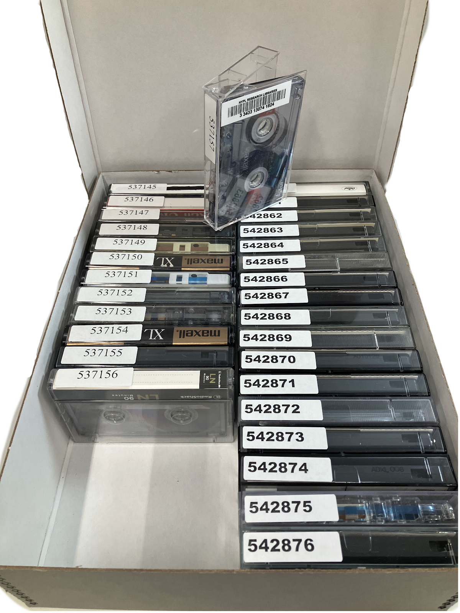

# **Processing Audio and Moving Image Material**
The arrangement and description of audio and moving image (AMI) material utilizes many of the same guiding principles as other archival materials, but involves additional steps because AMI is described on the item level to facilitate digitization for long-term preservation and access. This section details the tasks and special considerations that are necessary when working with AMI in archival collections, and addresses identification, inventory, and housing of these materials. The Media Preservation Services department facilitates and coordinates the preservation and digitization of AMI. See the [Media Preservation Documentation Portal](https://nypl.github.io/ami-preservation/) for further information about the ways in which media is digitized and preserved. 

## **Audio and Moving Image Inventory**
AMI in archival collections are accessioned on an item level by collection management when a new acquisition is received, or when a backlog collection is shipped to the Archival Processing unit for processing. Each piece of media is labeled with a barcode and a unique AMI identifier generated in SPEC. Collection management will also update SPEC with the format of each object. 

For acquisitions received in 2023 to the present, the AMI inventory will be attached to the acquisition record. Older collections may have a preliminary inventory with bibliographic data attached to the collection record. 

In the Archival Processing unit, the inventory of AMI in archival collections is performed by exporting a spreadsheet of the initial Collection Management inventory and enhancing it with DACS-compliant descriptive data, including titles, dates, and tracklists. During the inventory, if you encounter incorrect formats, you should correct the record in SPEC. The completed inventory will be imported into ArchivesSpace. See the section on [Importing an Audio and Moving Image Inventory]() into ArchivesSpace for instructions on how to do this.

## **Identification**

There are many resources that can aid in identifying the audio and moving image materials in a collection. Some helpful identification resources are listed below. If you are unable to identify any of the media in your collection, talk to your supervisor and contact the Manager of Audio and Moving Image Description.

**All Formats**

[University of Illinois Preservation Self-Assessment Program](https://psap.library.illinois.edu/collection-id-guide/#audiovisual) is a helpful guide for identifying most common audio and moving image formats.

The [National Archives](https://www.archives.gov/preservation/formats) preservation site has a section on archival formats, which includes sections for [audio](https://www.archives.gov/preservation/formats/audio-toc.html), [video](https://www.archives.gov/preservation/formats/video-toc.html), and [film](https://www.archives.gov/preservation/formats/motion-picture-film-toc.html). [The Museum of Obsolete Media](https://obsoletemedia.org/) is helpful if you encounter less common or rare audio and moving image formats.

**Video**

The Texas Commission on the Arts [Videotape Identification and Assessment Guide](https://www.arts.texas.gov/wp-content/uploads/2012/04/video.pdf) is a useful resource for information about all video tape formats.

**Film** 

Brian Pritchard’s site has a [guide](http://www.brianpritchard.com/IMPF.htm) to identifying both [16mm](http://www.brianpritchard.com/16mm%20Identification%20Version%201.02.pdf) and [35mm](http://www.brianpritchard.com/35mm%20Film%20Identification%20Version%203.2.pdf) film.

The National Film and Sound Archive of Australia has a [short technical guide](https://www.nfsa.gov.au/preservation/guide/handbook/identification) to film types.

## **Paper Materials in Audio and Moving Image Containers**
As you inventory and describe AMI, remove any loose papers and documentation found inside a media enclosure, and place these in a folder labeled with the identifier number of the Media Original item. By retaining this information, you will be able to describe the paper and AMI together in the finding aid. It is generally best to integrate each separated paper into the container list. For some legacy collections where the papers have already been separated and their origin is unclear, you may need to create a file with a title such as, _Separated Papers_, that includes all the separated items. 

## **Preservation Issues**
Often AMI with preservation issues is discovered during accessioning, and physically separated from the collection. The Manager of Audio and Moving Image Description and Collection Manager will assess the preservation concerns and determine whether the materials will need to be sent to a vendor for remediation. However, you still may encounter additional AMI content with preservation issues during your appraisal or inventory. Some common issues are mold and film with vinegar syndrome. The [filmcare.org](https://filmcare.org/visual_decay) site is a useful resource in helping to identify potential preservation issues. If you are unsure if something is an AMI preservation issue, reach out to the Manager of Audio and Moving Image Description and Collection Management for guidance.

## **Media Originals**
At NYPL, a single AMI item is called a Media Original. AMI is stored by format in division-specific media originals boxes. Below is information on how to properly store AMI in media originals boxes. A general guiding principle is that the _AMI ID_ numbers should be visible when looking into the box. Once a media originals box is full, apply a barcode to the box and scan the barcode into the object record for that box in the Media Originals collection for the correct curatorial division in SPEC. See the section of this documentation about [barcode placement]() for information on how to barcode each box type.

## **Media Originals Boxes**
Below is information on how to properly store audio and moving image items in media originals boxes. A general guiding principle is that the AMI ID numbers are visible when looking into the box. Once a media originals box is full, apply a barcode to the box and scan the barcode into the object record for that box in the Media Originals collection for the correct curatorial division in SPEC. The media originals collection number for each division is listed in the Creating New Media Originals Boxes section of this documentation. Consult with your manager to inditify the correct boxes for your collection. See the section of this documentation about barcode placement for information on how to barcode each box type.

### Audio Reels 
Stand on edge in record cartons 

### Audio Cassettes 
On long edge in cassette boxes. Cassette boxes are then stacked three to a record carton. 

### Small Video Cassettes (hi-8 and other small formats)
On long edge in cassette boxes. Cassette boxes are then stacked three to a record carton.

### Large Video Cassettes (U-matic/Beta)
With long edge greater than nine inches should be stored on long edge in record cartons. Place the identifier labels where they are visible when looking into the record carton.

This example shows beta tapes that fit on the short edge with labels on the top of the cassette (left and right) as well as longer cassettes (center) with labels on the spine.

### Video Cassettes (VHS) 
On the short edge standing in record cartons.

### Video Reels
Stand on edge in record cartons.

### Film 
Cans lie flat in record cartons, or on a shelf if they are too large. 

Films that are too large to fit in a media originals box will be treated as a unique media original item. The film canister should be labeled with a media original label, identifier number, and barcode. 

### Discs (Grooved Media) 
Should be stored on edge in upright disc boxes. Do not mix different sizes in the same box.

### CD / DVD
Should stand on edge in CD/DVD boxes.

## Creating New Media Originals Boxes
If there are no available Media Originals boxes for the format you are inventorying, or if you fill up an existing box, a new Media Originals box must be created in SPEC. Detailed instructions can also be found in section 4.5.3 [Create New Media Originals]() of the Audio and Moving Image Inventory and Other Processes in SPEC manual.
