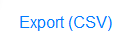

# Survey
Once you have completed the preliminary background research, you are ready to begin surveying the collection. The shelf locations of all the physical materials in a collection are found in SPEC. The goal of the survey is to attain a more comprehensive understanding of the collection's scope, content, and purpose. A thorough survey will result in a more precise and accurate processing proposal, which will help facilitate a more successful processing experience.

While you cannot and should not ever plan to review each item in a box, you should look inside each box to get a general sense of the types of materials that comprise the collection. If the collection holds electronic media, contact the Digital Archives team at <digitalarchives@nypl.org> in order to review carriers, files, and/or other details that may be available prior to file transfers and imaging. This information may also help you make appraisal decisions, and provide insight on the records’ existing arrangement. 

Surveying the Born-Digital content concurrently with the paper and audio and moving image materials will result in the most accurate estimate for how long it will take to process the entire collection. Consider the ways in which electronic records, as well as any audio and moving image materials connect with the physical items in each container. 

There are many potential ways to organize your notes during your survey, and since these notes are for your own reference, there is no one correct way to do this. Some common methods include a spreadsheet with a row for each container, or a text document with bullet point notes. You can also export a csv file for the acquisition or collection objects list from SPEC, which is helpful when working with very large collections. The export csv button is located on the bottom right of the objects list in SPEC. 

After you click on the button, a csv file will automatically be generated and saved to your desktop as object_search_export_[SPEC username]_date.

It is just important that your survey notes are orderly so that you are able to understand the full scope of the collection, and notice any patterns that may emerge. 

If the collection came with an inventory by the seller or donor, or if there are accessioning notes present, you should consult these materials during your survey. Note if there are any major discrepancies between the inventory and what you see in the collection, and use this existing documentation to provide a more complete picture of the collection’s scope, content, and arrangement. If the curator, seller, or donor has specifically called attention to certain significant items in the collection, make note of which container holds these materials.

When you remove containers from the stacks, make sure to update their locations in SPEC using the location barcode for your workspace. See the section of this documentation on [Location Management](/Location_Management.md) for more information. 

As you review each container during the survey take note of the following:

**Arrangement**: Try to discern the current arrangement of the materials in each box, and how this relates to the collection as a whole. Take care not to disrupt the received order of the collection during the survey. Any physical rearrangement should wait until processing begins, but this is a good time to consider potential series and arrangement possibilities.

**Content:** Scan the contents of each box and take notes about what is there. Think beyond just the formats that are present, and consider why these records were created and saved, as well as what the materials document, and any narratives that emerge. Take note of what you do not find in the collection, and record any gaps you notice. Just as archivists hold our own biases, so do collectors and creators, so it is important to reflect on what is present, what is missing, and to be an active participant in deciphering what narrative that conveys.[^1]

**Dates:** As you survey the collection, take note of the timeframe that is represented and date range of the records’ creation. 

**Biographical Information:** Make note of any biographical information about the collection’s creator that may emerge during the survey. You can utilize this information in the finding aid’s _Administrative/Biographical_ note. Also take note of other contributors who may have created these records, other individuals or events the collection documents, and with whom the creator collaborated or corresponded.

**Preservation Issues:** Record any issues with the collection’s physical condition such as mold, evidence of pest infestation, water damage, fragile items, or materials that may require custom housing.

**Restricted Materials:** Pay attention to materials that may need to be restricted or suppressed in the finding aid. These restrictions are often included in the deed of gift or purchase agreement, which may state a timeframe that the records will need to be held back. In addition to donor stipulated restrictions, look out for sensitive materials such as medical records, student records, documents containing social security numbers, personal financial records, attorney-client privileged legal documents, company personnel records, and classified government documents. This documentation includes a section on how to identify [classified government documents](/Identification_and_Handling_of_Classified_Documents.md), and the steps to take if you find them. 

It is also important to think beyond this purely legal framework, and consider the intent and privacy of the records creator, along with the potential users of the collection.[^2] Just because restrictions are not specifically noted in the deed does not mean the materials should always be made available to the public. Conversely, materials that may depict the records creator negatively does not automatically necessitate the need to restrict it.[^3]

**Electronic Records**: Electronic records are removed during accessioning, but it is possible that some items may have been missed. If you locate floppy disks, hard drives, flash drives, or any other digital media, remove the items and note which container you found it in. Then reach out to Collection Management and let them know you have found additional material that has not been accessioned. Once the media has been accessioned, labeled, and barcoded, place all the digital media on the incoming media shelf, and then send an email to <digitalarchives@nypl.org> to notify them about the new materials.

---

[^1]: Lizeth Zepeda reminds us that “When actively describing materials and collecting people’s past experiences, biases will nevertheless be present. There is a need to have a deep reflection and acknowledgement of who is being excluded from these narratives” and that “Archivists should instead be conscious of this and participate in the interpretation of these materials.”Lizeth Zepeda, “Queering the Archive: Transforming the Archival Process,” _DisClosure: A Journal of Social Theory_ 27, no. 1 (July 1, 2018): 95, [doi:https://doi.org/10.13023/disclosure.27.14](https://uknowledge.uky.edu/disclosure/vol27/iss1/17/).

[^2]: Michelle Caswell and Marika Cifor remind us that “We can no longer operate as if archival users are all detached neutral subjects without a stake in the records they are using,” Michelle Caswell and Marika Cifor, “From Human Rights to Feminist Ethics: Radical Empathy in the Archives,” _Archivaria_, May 6, 2016, 37–38, <https://archivaria.ca/index.php/archivaria/article/view/13557>.

[^3]:  Caswell and Cifor also state that, “In a relationship of caring, we must balance our desire to capture histories that would otherwise be silenced in the archival record with the privacy, desires, and needs of the subjects of our records.” Ibid, 37.

