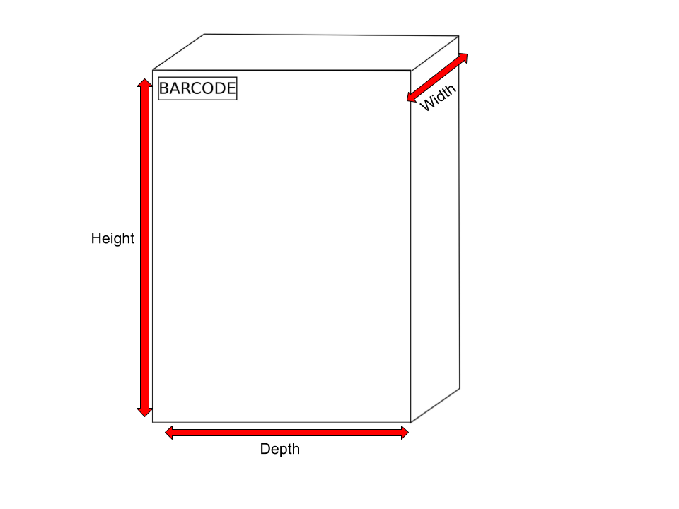
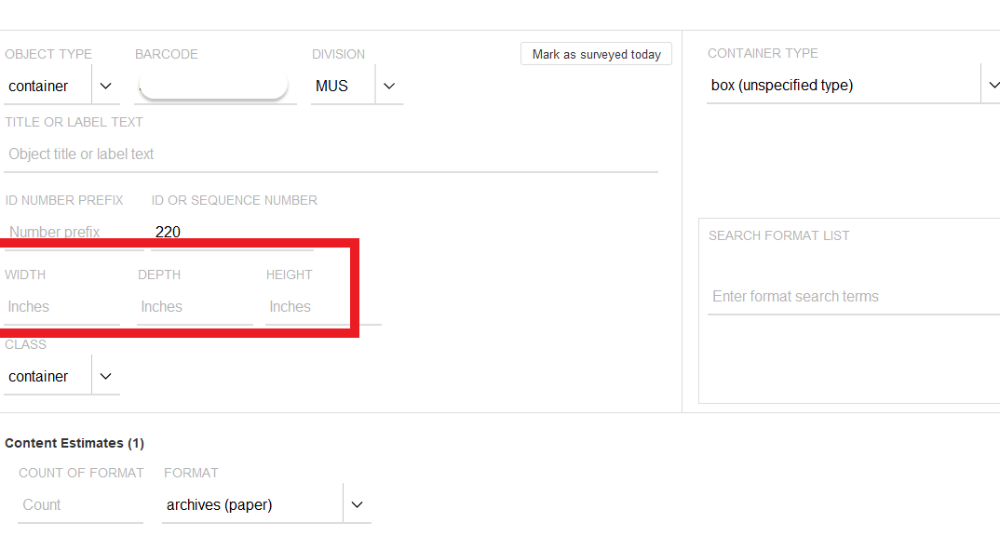
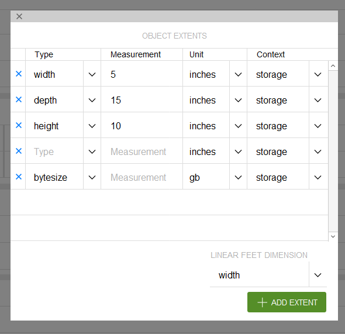
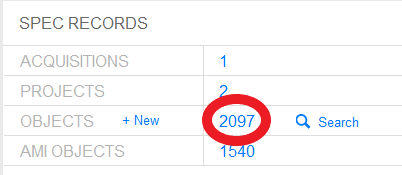

# Updating SPEC
{: .no_toc }

There are a number of tasks that need to be completed in SPEC both during and after processing a collection. This section details some of those workflows.

## Table of Contents
{: .no_toc .text-delta }

- TOC
{:toc}

# Updating Processed Object Records in SPEC
It is recommended that you deactivate a collection’s original container as you are processing. Once you have finished processing a collection, you should verify that you have made all original containers inactive in SPEC, and double check that you did not miss any of the unprocessed materials. In most cases objects should be deactivated from the _acquisition record_. However, if you are processing a backlog collection without an acquisition record, or an artificial collection without acquisition information, then you will need to deactivate the boxes from the _collection record_. 

Below are the steps and some accompanying images that illustrate how to deactivate boxes in a SPEC acquisition record. If you are working on backlog, legacy, or an artificial collection, skip to [Deactivating Objects in a Collection Record]().

## Deactivating Objects in an Acquisition Record
Login to SPEC and select find/propose an acquisition in the Acquisitions menu.

The acquisitions search screen will open. Enter the acquisition identifier or acquisition title and select search.

The search results will appear below the search menu. Select the acquisition record you need to update by clicking on the acquisition name.

A screen will open with detailed information about the acquisition. Select the _inventory_ icon in the _extent summary_ box to view the objects associated with the acquisition.

 A new screen will open listing all the objects associated with the collection. This will often include audio and moving image items, digital media carriers, received boxes that were rehoused, and unprocessed containers with their original stacks locations. 

To deactivate a box, click on the ^ icon and select deactivate from the pop-up menu as illustrated below. 

A new dialog box will open that is populated with the current date in the _When_ field and your SPEC username in the _Deactivated By_ field. The _Reason For Deactivating_ field has a dropdown menu. Click on the dropdown menu icon on the right to open the menu.

Select the reason you are deactivating the object record from the menu. When deactivating boxes from processed collections, you should always select Contents rehoused.

Once you have made your selection, click on the _confirm_ button.

If you wish to deactivate multiple boxes at once, use the SPEC bulk deactivation feature, which allows you to select all the objects you need to deactivate. See the section of this documentation on [Bulk Object Deactivation]() for more information about how to do this. 

## Deactivating Objects in a Colletion Record
Login to SPEC and select _search all collections_ in the _Collections menu._

The collections search screen will open.

Enter the collection identifier or title, and select _search_.

The search results will appear below the search menu. Select the collection you need to update by clicking on the collection name.

A new screen will open with the collection’s summary information, including the call number, format counts, and linked records. Click on the number to the right of the word _objects_ under the SPEC Records menu. This number indicates the total number of objects associated with the collection record.

A new screen will open listing all the objects associated with the collection. After a collection has been processed, all the old boxes need to be deactivated. 

To deactivate a box, click on the ^ icon and select deactivate from the pop-up menu as illustrated below.

A new dialog box will open that is populated with the current date in the _When_ field and your SPEC username in the _Deactivated By_ field. The _Reason For Deactivating_ field has a dropdown menu. Click on the dropdown menu icon on the right to open the menu. 

Select the reason you are deactivating the object record from the menu. When deactivating boxes from processed collections, you should always select _Contents rehoused_.

Once you have made your selection, click on the confirm button.

If you wish to deactivate multiple boxes at once, use the SPEC bulk deactivation feature, which allows you to select all the objects you need to deactivate. See the section of this documentation on [Bulk Object Deactivation](https://nypl.github.io/pres-docs/archivalProcessing/updating_processed_object_records_in_SPEC.html#bulk-object-deactivation-in-spec) for more information about how to do this. 

## Bulk Object Deactivation in SPEC
Navigate to the collection’s objects list.

The objects will display in list format with check boxes to the left, as illustrated in the image below. 

Make sure you are in the _object search_ screen, and not the _batch editor view_. Bulk edit functionality is not available in the _Batch edit_ screen.

Select all the objects you wish to deactivate by clicking in the boxes to the left of the object name. You may also select all objects by navigating to the _Action_ menu and choosing _Select All_.    

 

Click on the _Action_ menu at the top and select _Deactivate Selected Objects._

A dialog box will open asking for the reason you are deactivating the objects. You should always select _Contents Rehoused_.

Press the _Confirm_ button after you have selected _Contents rehoused_ from the menu.

A box will pop up asking if you would like to deactivate all the selected objects. Press _OK_.

The objects you selected will be deactivated and appear crossed out in the objects list.

# Importing Object Records Into SPEC
After your finding aid has been approved by your supervisor and curatorial staff, you have barcoded each box, scanned the barcodes into ArchivesSpace, and deactivated the processed containers in SPEC, you will need to import the collection’s containers from ArchivesSpace into SPEC.

First open up the collection in ASpace and select _Export Item CSV_ from the _Export_ dropdown menu.

ASpace will then generate a csv file of all the containers, each container’s extent (for container types that include dimensions in ASpace), and each container’s barcode. Make sure to save the file in a place where you can easily locate it later. 

If you have to open up the csv file in Excel for editing purposes, be sure to format the cells in the barcode column before you save the file. To do this, highlight the column of barcodes, then right click _Format Cells_. While working in the number tab, click on _Number_ under Category and change Decimal places to 0. This will allow the format of the cells to display the entire barcode numbers correctly. This is very important in order for the barcodes to be correctly imported into SPEC.

Next navigate to  the _collection record_ in SPEC, and locate the _SPEC RECORDS_ portion of the screen.

Select the _ASpace Object Import_ button

A navigation window will pop up. Select the csv file you created, and click _open._

The containers will be imported as objects in the collection record. If your collection includes any containers without dimensions in ASpace, be sure to manually enter them into SPEC so that the collection extent is correct. See the section of this documentation on [Updating Container Dimensions in SPEC]() for instructions on how to do this.

Once the new containers have been imported, make sure to update their locations in SPEC. For instructions on how to update locations, see the [Location Management](https://nypl.github.io/pres-docs/archivalProcessing/Location_Management.html)section of this documentation.

# Updating Container Dimensions in SPEC
After you import your ASpace containers into SPEC, you will need to update the dimensions for all non-standard sized containers. 

You will always need to update the extent in SPEC of the following containers:

- Volume (small)
- Volume (medium)
- Volume (large)
- Custom Box
- Custom Folder

In order to update the container extent, you must first navigate to the collection record, or to the individual object using the _Object Barcode App_. Then you can either open the specific object record you need to update, and edit the dimensions in the basic fields view, object view, or open the batch edit view.

## How to Measure Non-Standard Containers
When measuring the dimensions of a custom or non-standard sized container, you will need to record the width, depth, and height of the object. In general the width of a box or volume is the smaller dimension and the depth is the longer dimension. 

When calculating the dimensions of frames, measure in their display orientation. When looking at the frame head-on, the width is the distance from the left edge to the right edge. The depth is from top to bottom. The height is the thickness/front to back.

The examples below illustrate how to identify the width, depth, and height of archival containers. For further information on labeling, barcodding, and measuring containers, see [Collection Management's Visual Guide 🔒](https://docs.google.com/document/d/1FiHAQ0Ywdkbn_iyP6o1szZ6f0karvNhLiG-ggGDumDM/edit?usp=sharing).

### Measuring Custom Boxes

### Measuring Custom Volumes and Phaseboxes

### Measuring Custom Folders

## Updating Container Dimensions From _Basic Fields_ in SPEC

Scan the barcode of the object you wish to update into the _Object Barcode App_ or Navigate to the object from the Collection Record.

You can open the _Basic Fields_ tab by clicking on the container number, container type, barcode, or class from the object record screen. 

This will open the _Basic Fields_ tab. Enter the Width, Depth, and Height in the fields circled below. Close the box by clicking on the X in the upper left.

Clicking the X will automatically save the dimensions and calculate the container’s extent. The extent field in the object record will also automatically be updated.

You can also update an object’s dimensions by clicking on the extent field. This will open up an object extent dialog box. Fill in the correct Height, Width, and Depth, then select the X to close the box. Your changes will automatically be saved and updated in the extent field in the object record.

Repeat these steps to update the extent for each non-standard sized container in your collection. 

## Updating Container Dimensions From _Batch Edit_ in SPEC
If you have many extents to update, you can also do this from the _Batch Edit_ view in SPEC To get to the _Batch Edit_ view, navigate to the SPEC collection record and click on the number next to _objects_.

The Object Search screen will open. Select _All_ next to where it says _Batch Edit._

This will open the _Batch Object Editor_. Scroll to the right to view each object’s dimensions. You can edit the dimensions by typing in the Width, Depth, and Height for each object in the appropriate field.

