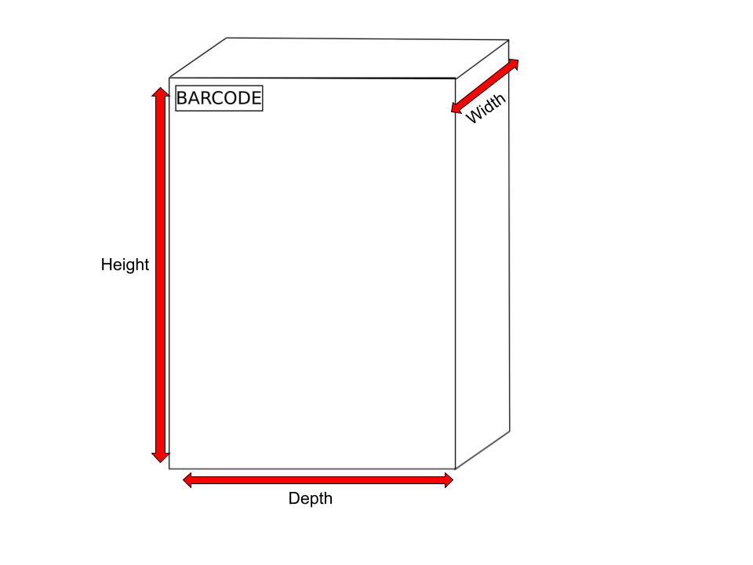
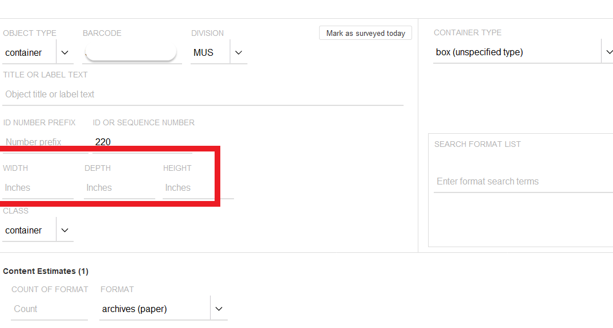
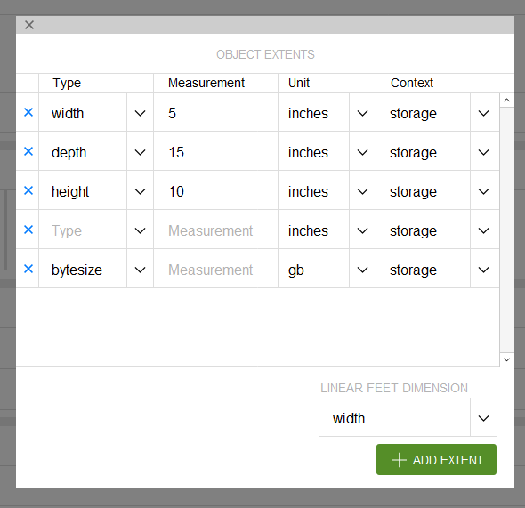
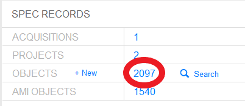

# Updating Container Dimensions in SPEC
{: .no_toc }
After you import your ASpace containers into SPEC, you will need to update the dimensions for all non-standard sized containers. 

You will always need to update the extent in SPEC of the following containers:

- Volume (small)
- Volume (medium)
- Volume (large)
- Custom Box
- Custom Folder

In order to update the container extent, you must first navigate to the collection record, or to the individual object using the _Object Barcode App_. Then you can either open the specific object record you need to update, and edit the dimensions in the basic fields view, object view, or open the batch edit view.

## Table of Contents
{: .no_toc .text-delta }

- TOC
{:toc}

## How to Measure Non-Standard Containers
When measuring the dimensions of a custom or non-standard sized container, you will need to record the width, depth, and height of the object. In general the width of a box or volume is the smaller dimension and the depth is the longer dimension. 

When calculating the dimensions of frames, measure in their display orientation. When looking at the frame head-on, the width is the distance from the left edge to the right edge. The depth is from top to bottom. The height is the thickness/front to back.

The examples below illustrate how to identify the width, depth, and height of archival containers. For further information on labeling, barcodding, and measuring containers, see [Collection Management's Visual Guide 🔒](https://docs.google.com/document/d/1FiHAQ0Ywdkbn_iyP6o1szZ6f0karvNhLiG-ggGDumDM/edit?usp=sharing).

### Measuring Custom Boxes

### Measuring Custom Volumes and Phaseboxes

### Measuring Custom Folders

## Updating Container Dimensions From _Basic Fields_ in SPEC

Scan the barcode of the object you wish to update into the _Object Barcode App_ or Navigate to the object from the Collection Record.

You can open the _Basic Fields_ tab by clicking on the container number, container type, barcode, or class from the object record screen. 

This will open the _Basic Fields_ tab. Enter the Width, Depth, and Height in the fields circled below. Close the box by clicking on the X in the upper left.

Clicking the X will automatically save the dimensions and calculate the container’s extent. The extent field in the object record will also automatically be updated.

You can also update an object’s dimensions by clicking on the extent field. This will open up an object extent dialog box. Fill in the correct Height, Width, and Depth, then select the X to close the box. Your changes will automatically be saved and updated in the extent field in the object record.

Repeat these steps to update the extent for each non-standard sized container in your collection. 

## Updating Container Dimensions From _Batch Edit_ in SPEC
If you have many extents to update, you can also do this from the _Batch Edit_ view in SPEC To get to the _Batch Edit_ view, navigate to the SPEC collection record and click on the number next to _objects_.

The Object Search screen will open. Select _All_ next to where it says _Batch Edit._

This will open the _Batch Object Editor_. Scroll to the right to view each object’s dimensions. You can edit the dimensions by typing in the Width, Depth, and Height for each object in the appropriate field.

