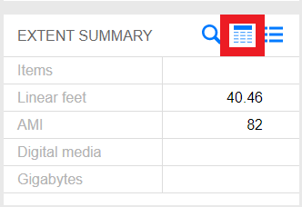
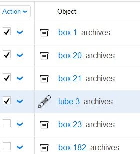

# Updating Processed Object Records in SPEC
{: .no_toc }
It is recommended that you deactivate a collection’s original container as you are processing. Once you have finished processing a collection, you should verify that you have made all original containers inactive in SPEC, and double check that you did not miss any of the unprocessed materials. In most cases objects should be deactivated from the _acquisition record_. However, if you are processing a backlog collection without an acquisition record, or an artificial collection without acquisition information, then you will need to deactivate the boxes from the _collection record_. 

Below are the steps and some accompanying images that illustrate how to deactivate boxes in a SPEC acquisition record. If you are working on backlog, legacy, or an artificial collection, skip to [Deactivating Objects in a Collection Record]().

## Table of Contents
{: .no_toc .text-delta }

- TOC
{:toc}

## Deactivating Objects in an Acquisition Record
Login to SPEC and select find/propose an acquisition in the Acquisitions menu.

The acquisitions search screen will open. Enter the acquisition identifier or acquisition title and select search.

The search results will appear below the search menu. Select the acquisition record you need to update by clicking on the acquisition name.

A screen will open with detailed information about the acquisition. Select the _inventory_ icon in the _extent summary_ box to view the objects associated with the acquisition.

 A new screen will open listing all the objects associated with the collection. This will often include audio and moving image items, digital media carriers, received boxes that were rehoused, and unprocessed containers with their original stacks locations. 

To deactivate a box, click on the ^ icon and select deactivate from the pop-up menu as illustrated below. 

A new dialog box will open that is populated with the current date in the _When_ field and your SPEC username in the _Deactivated By_ field. The _Reason For Deactivating_ field has a dropdown menu. Click on the dropdown menu icon on the right to open the menu.

Select the reason you are deactivating the object record from the menu. When deactivating boxes from processed collections, you should always select Contents rehoused.

Once you have made your selection, click on the _confirm_ button.

If you wish to deactivate multiple boxes at once, use the SPEC bulk deactivation feature, which allows you to select all the objects you need to deactivate. See the section of this documentation on [Bulk Object Deactivation]() for more information about how to do this. 

## Deactivating Objects in a Colletion Record

Login to SPEC and select _search all collections_ in the _Collections menu._

The collections search screen will open.

Enter the collection identifier or title, and select _search_.

The search results will appear below the search menu. Select the collection you need to update by clicking on the collection name.

A new screen will open with the collection’s summary information, including the call number, format counts, and linked records. Click on the number to the right of the word _objects_ under the SPEC Records menu. This number indicates the total number of objects associated with the collection record.

A new screen will open listing all the objects associated with the collection. After a collection has been processed, all the old boxes need to be deactivated. 

To deactivate a box, click on the ^ icon and select deactivate from the pop-up menu as illustrated below.

A new dialog box will open that is populated with the current date in the _When_ field and your SPEC username in the _Deactivated By_ field. The _Reason For Deactivating_ field has a dropdown menu. Click on the dropdown menu icon on the right to open the menu. 

Select the reason you are deactivating the object record from the menu. When deactivating boxes from processed collections, you should always select _Contents rehoused_.

Once you have made your selection, click on the confirm button.

If you wish to deactivate multiple boxes at once, use the SPEC bulk deactivation feature, which allows you to select all the objects you need to deactivate. See the section of this documentation on [Bulk Object Deactivation](https://nypl.github.io/pres-docs/archivalProcessing/updating_processed_object_records_in_SPEC.html#bulk-object-deactivation-in-spec) for more information about how to do this. 

## Bulk Object Deactivation in SPEC

Navigate to the collection’s objects list.

The objects will display in list format with check boxes to the left, as illustrated in the image below. 

Make sure you are in the _object search_ screen, and not the _batch editor view_. Bulk edit functionality is not available in the _Batch edit_ screen.

Select all the objects you wish to deactivate by clicking in the boxes to the left of the object name. You may also select all objects by navigating to the _Action_ menu and choosing _Select All_.    

 

Click on the _Action_ menu at the top and select _Deactivate Selected Objects._

A dialog box will open asking for the reason you are deactivating the objects. You should always select _Contents Rehoused_.

Press the _Confirm_ button after you have selected _Contents rehoused_ from the menu.

A box will pop up asking if you would like to deactivate all the selected objects. Press _OK_.

The objects you selected will be deactivated and appear crossed out in the objects list.

