# Printing SPEC AMI ID Labels
This function is not available in the SPEC client, using instead Microsoft Excel and the Mailings function in Microsoft Word.
 
 
Contact the Systems and Operations (SysOps) Coordinator to assign you a range of SPEC AMI IDs before proceeding.
## Required Supplies
- Avery 5167 Return Address Labels (1/2" in. x 1 3/4" in.)
## Creating Numbers List in Excel
- Open a new Excel document.
- Create the heading _Numbers_ in field A1
- Type the first number in your SPEC AMI ID range assigned by SysOps in field A2 and the second numbder in field A3.

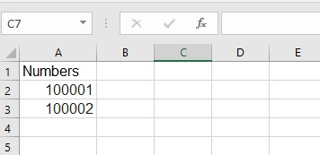
- Select cells A2 and A3.

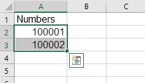
- Hover over the lower right corner of the selected cells until the cursor turns into a black cross.
- Click, then drag the cells down until you reach the highest number you wish to print. If you are printing a single sheet of labels, then you will need to drag down to row 81.

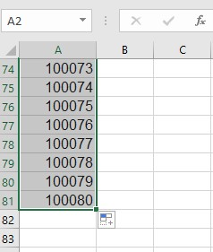
- Once you have the desired number of labels, save the document and close Excel.
## Creating a Mail Merge in Word
- Open a blank Word document. Go to the _Mailings_ tab.
Select _Start Mail Merge_, and then _Labels..._ from the dropdown menu.

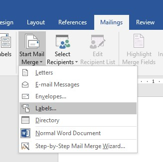

- Select the correct label template from the dropdown menu (Avery 5167) and hit _OK_. This will create a screen of blank labels.

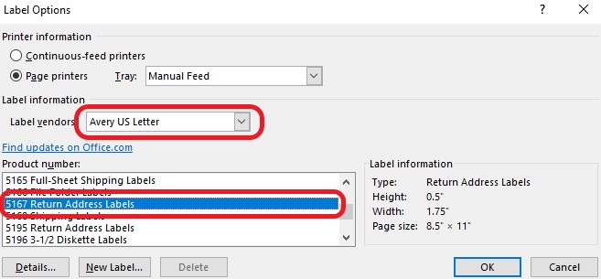
- Next, while making sure your cursor is in the top left field, go to the _Select Recipients_ menu, and choose _Use an Existing List..._ from the dropdown menu.

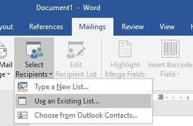
- A file explorer window will open. Navigate to the Excel file you created, and hit _Open_. 
- A _Select Table_ window will pop up. Select your file, and make sure the _First row of data contains column headers_ box is checked. Then hit _OK_.

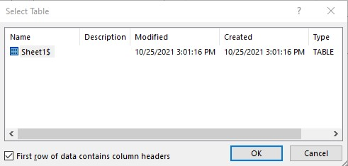
- The screen will now show the repeating message `<<Next Record>>` in each field.

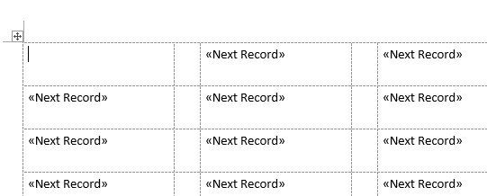
- Next go to the _Insert Merge Field_ and select _Numbers_.

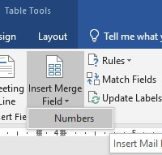
- Select _Update Labels_ from the menu at the top of the screen.

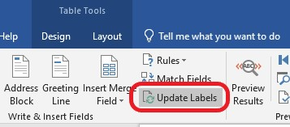
- The display will update again to include `<<Numbers>>`

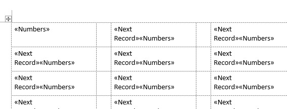
- Choose  _Preview Results_ from the menu at the top, and the display will show the first page of labels.

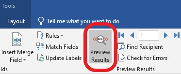

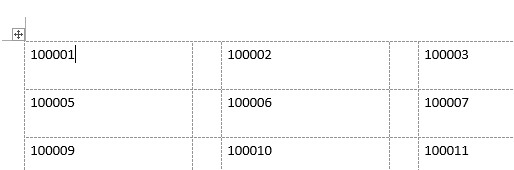
- In order to see all the pages, go to the _Finish & Merge_ menu and select _Edit Individual Documents..._ 

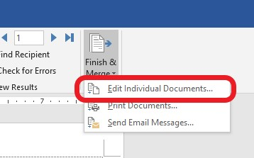
- A window will pop up asking if you want to merge to a new document. Select _All_ and hit _OK_.
 
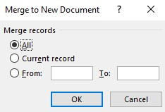
- A new document of all the labels will open. 
- Hit <kbd>CTRL + A</kbd> to select all.
- Resize and center the numbers so they fit in the template. Arial Black font size 22 is recommended. 
- Now you are ready to print your labels. Make sure to select _print on one side_, and to choose _manual feed_ so you can feed the labels into the printer. 