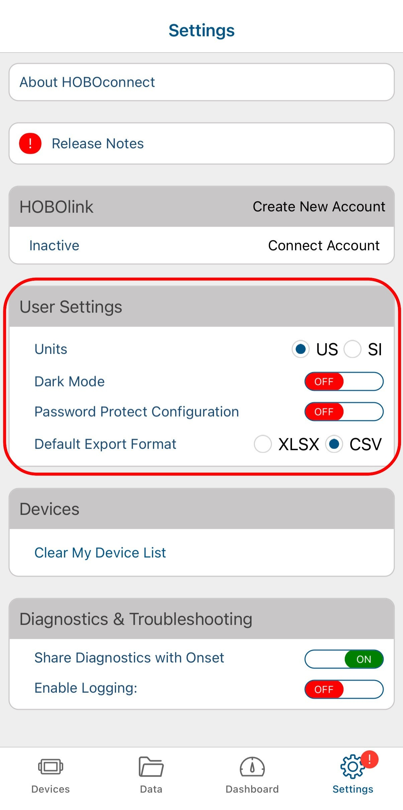
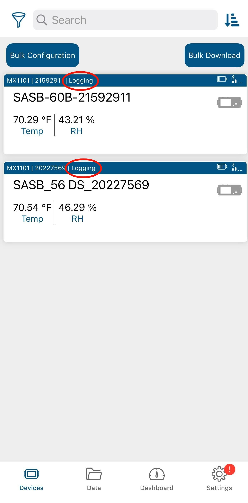
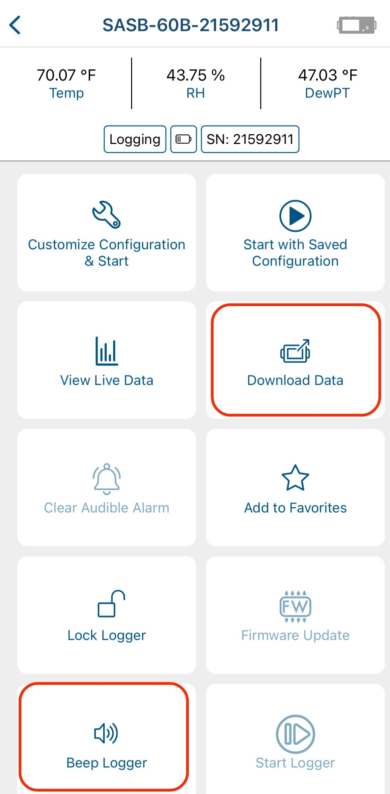

{: .note }
> This page is under construction!
> More content coming soon...

# **Environmental Monitoring Manual**
## **Collection Management Procedures and Instructional Guide**
June 2022, updated January 2024

## **Introduction**

Collection Management (CM) conducts monthly monitoring of all spaces in which collections are used and stored using HOBO datalogger devices. Environmental conditions are analyzed in eClimateNotebook and findings are shared with Collection Management (CLMGT) in monthly email reports using Airtable. HVAC adjustments and concerns are communicated to Facilities. Monthly monitoring is useful for collecting long term preservation data and addressing current preservation needs.

## **Section 1: Downloading Data**

Environmental data from all spaces is downloaded each month at the end of the month. In addition, Collection Management sometimes increases monitoring in particular spaces when there are specific causes for concern, such as when there is consistently high RH, if there are drastic changes in conditions throughout a previous month that we want to keep an eye on, or if we are contacted by a concerned division staff member.

### **Section 1.1: HOBO Dataloggers**

HOBO MX1101 datalogger devices are used to monitor the environmental conditions across the Research Libraries and LSC in all spaces where collections are found, including storage, collection workspaces, reading rooms, galleries, and offices. For a comprehensive list of all dataloggers, both current and discontinued, and where they are located, see the “Loggers” table in the [Preservation Environment Airtable Base](https://airtable.com/appdyGUVHYBU0AQmP/tblVHMsSmAAKX6awi/viwzwWwPfx5EmZxdc?blocks=hide). This table lists the three different names each logger is referred to by: logger number, the HOBO Mobile Logger Name, and the eClimateNotebook Location Dataset Name. It can be helpful to reference the table while collecting data to know exactly where each logger is located and to ensure that none are accidentally missed. 

#### **Section 1.1.1: Dataloggerpalooza**

All dataloggers across the Research Libraries and LSC are replaced every two years in September to ensure accurate calibration in an event referred to as Dataloggerpalooza. All of the dataloggers are replaced and new ones are deployed. It is also determined if any dataloggers need to be discontinued, added, or locations changed. There are four main tasks associated with the event:

1. Set up new dataloggers

2. Enter new logger information in Preservation Environment Airtable base

3. Deploy new loggers to storage areas

4. Remove old loggers

For instructions on how to complete each of these tasks, see [Dataloggerpalooza Procedures](https://docs.google.com/document/u/0/d/1aj7Fo6CDWEYUUerXRL_dbyw9gfwcOzBypqDztAv9prw/edit).

## **Section 1.2: HOBOconnect**

HOBOconnect is the app used to download data from the HOBO Dataloggers. It can be downloaded onto an iPad or personal cell phone and it connects to the loggers via Bluetooth. To download environmental data: 

1) Download the HOBOconnect app on an iPad or cell phone.

2) The first time you open the app, tap on “Settings” in the lower right corner of the bottom menu bar. Under “User Settings,” select “US” for the “Units” and select “CSV” for “Default Export Format.”

3) Next, tap on “Devices” in the lower left corner of the bottom menu bar.

4) As you walk around to different spaces in your building, loggers will become visible. The full HOBOconnect logger name will not show up until your device has connected to the logger at least once. Until that point, it will just show the logger’s serial number. For the exact location of every logger, see the “Loggers” table in the [Preservation Environment Airtable Base](https://airtable.com/appdyGUVHYBU0AQmP/tblVHMsSmAAKX6awi/viwzwWwPfx5EmZxdc?blocks=hide).

5) Stand in the general area of the logger. Wait until you see the logger you want pop up on the screen. When it does, make sure that the logger says, “Logging” and not “Stopped.” If it says “Stopped” something went wrong. Likely, the memory on the logger is full or the batteries died.

   1. If your logger has stopped logging or is missing, you will need to create a Logger Event in the “Logger Events” table in the [Preservation Environment Airtable Base](https://airtable.com/appdyGUVHYBU0AQmP/tblD2IIlFMzk4Xu63/viwzdwNCVm94fpPJr?blocks=hide). For instructions on how to do so, see the base description, which is accessible by clicking on the down arrow next to the title of the base and scrolling down to the section focusing on the “Logger Events” table. 

   

6) Tap the logger you want to download. 

7)  Select “Download Data.” Wait for the download to complete. If the readout takes a long time or stops, you may need to start over and get closer to the logger. To easily find a logger, press and hold on “Beep Logger” and the logger will make a sound.

8) Once the download completes, tap “Done” at the bottom of the screen.

9) To confirm that the data was downloaded, click on the folder icon labeled “Data” on the bottom of the screen.

10) Each of the data files that you have downloaded will be listed here.

11) There is a bulk download feature for downloading multiple loggers that are close to one another at the same time. Click on “Bulk Download” in the upper right corner of the “Devices” page. 

12) Select the loggers you want to download by clicking on the small circle to the left of the logger name. The small circle will be empty until it is selected, when it is then filled with a checkmark. Once you select the loggers you want to download, click on “Download X loggers.”

13) Once the loggers finish downloading, select “Done” in the top left corner of the screen. 

14) Next, check to see how much battery each logger has as well as how full the memory is. In the current version of the app, you do so by looking at the small icons on the logger screen. Select a logger to connect. The small battery icon at the top of the screen indicates how much battery is left. If there is only one bar left, the batteries should be replaced. The small icon on the lower right indicates the amount of memory used. If it appears to be almost full, the logger’s memory should be cleared. 
 1. *If the batteries need to be replaced:* make sure to download and export any data on the logger first, because otherwise it will be lost. Once the data is downloaded, then take out the old batteries and put the new ones in. When the logger pops up in the logger list in the app, it will say “Power Reset.”
      1. Next, click on “Configure & Start” in the upper left of the screen in the app. A window will pop up confirming that you want to configure the device. Click “Yes.” Then, click the “Start” button on the bottom right.

1. *If the logger’s memory needs to be cleared:* click on “Configure & Start” in the upper left of the screen in the app. A window will pop up confirming that you want to configure the device. Click “Yes.” Then, click the “Start” button on the bottom right.
15) Once you finish downloading the data for all spaces in your building, the files need to be exported. Click on the folder icon labeled “Data” on the bottom of the screen.

16)  Click “Export and Share” in the upper right corner. 

17) Select each of the files you want to export and then select “Export X Files” at the bottom of the screen. 

18) A window will pop up at the bottom of the screen asking for which format you want the files in. “CSV” should already be listed. Then press “Export.”

19) Each of the files will download and show up in green when they are ready to share. Once all files are downloaded, a window will pop up at the bottom of the screen. Select “Share” and send them to yourself via email. 
 1. Only 20 files can be exported at a time, so repeat this process as many times as necessary until all files are exported. 

20)  Once you export the data from HOBOconnect and receive the email(s) with your downloaded data, download the files onto your computer. You can download the folder so all of the files are downloaded together. The downloaded file will be zipped due to its size, so right click on the folder and select “Extract All.”

21) The data is now ready to be uploaded into eClimateNotebook

22) These exported files with the raw data from HOBOconnect also need to be saved in the [Environmental Monitoring](https://drive.google.com/drive/folders/1uRHAKVWL5vCrOJBtjaUuRYjRg77tD9MF?usp=sharing) folder in the Google Drive. Select the folder for the present year, and then click on your building. Open the folder titled “Uploaded to ECNB” and save the files here. The files do not need to be renamed or changed at all and they are not organized in any particular way. Simply drag and drop the files into the folder. Keeping these files is more of a precautionary measure in the event of an eClimateNotebook crash. They can then be deleted from your downloads as well as your email.

23) Once you confirm that the data has been successfully uploaded to eClimateNotebook (for how to do so, see [Section 2.1: Uploading New Data](https://docs.google.com/document/d/1YIXS8zJIqLuNrR9WnhwrLkCVrwSlcjn7N5oeGQMJVyw/edit#heading=h.zc9ic1tgyp37)) and saved in the Google Drive, you can delete the files. If you have a small number of files, you can delete them in HOBOconnect, by swiping from right to left on each individual file and selecting the trash can. When it asks you to confirm, select “Delete.”

24) If you have a large number of files to delete, this can be done by batch in the “Files” app on your phone or iPad. The app will be located in different locations on different devices, so if you are struggling to find the icon, just search for “Files” in the search bar on your device. 

25) When you open the Files app, make sure that you are in the “On my iPad” page (or “On my iPhone” if using your phone).  

26) Click on the HOBOconnect folder. 

27) Click on the “CSVs” folder.

28) Click on the three dots in the upper right corner and choose “Select.” Click on all of the datasets you would like to delete and then click on the trash can icon in the lower right corner. Deleting the files here will also delete them from the HOBOconnect app. If you go back to the “Data” page, it will now be empty. 

## **Section 2: eClimateNotebook**

eClimate Notebook is the online program used to track the environmental data for all of the Research Libraries and LSC. Data for some spaces is available as far back as the year 2000, though most dataloggers were installed starting in 2017 upon the foundation of the Collection Management program. eClimate Notebook allows us to look at metrics such as temperature, relative humidity, dew point and mold risk in order to analyze potential threats to collections caused by environmental conditions. 

### **Section 2.1: Uploading New Data**

After you finish downloading environmental data in each space using HOBOconnect and send yourself the files via email, they need to be uploaded into eClimate Notebook.

Once logged in, select “Data Manager” in the bar at the top of the page and follow the below instructions:

1. Click on “Upload” and a finder window will pop up. Select all of the files you want to upload (click and drag all) and click “Open.”

2. Once the data has been successfully uploaded, it is displayed in a chart with two columns: “Data File” and “Location Dataset Name.” In the “Location Dataset Name” column, each of the names needs to be changed to include just the location dataset name (“Building-Room Number”). All of the numbers after the room number should be deleted. 

   1. Once you delete the extra numbers, the room name will appear in a drop down menu. Select the room. Doing so connects the data you are uploading to all other past data for that space.

3. When you finish shortening all of the Location Dataset Names, click “Ok.”

4. The data will then begin to upload. Once it is finished, click on “Continue to Graphs.” 

5. If a new dataset is uploaded (i.e. for a new room) that is not associated with a space in the location hierarchy (visible on the left side of the screen), it will show up as unassigned at the bottom of the locations list. To insert it into the hierarchy, use the “Manage Hierarchy” field under “Data Manager” at the top of the page. For more information, see [Section 2.2.1.2: Manage Hierarchy](https://docs.google.com/document/d/1YIXS8zJIqLuNrR9WnhwrLkCVrwSlcjn7N5oeGQMJVyw/edit#heading=h.lduxw499mq0r).

### **Section 2.2: Organizing and Editing Datasets** 

#### **Section 2.2.1: Data Manager**

There are three fields under the “Data Manager” header: “Upload Data,” “Data History,” and “Manage Hierarchy.” For an in-depth description of how to upload data, see [Section 2.1: Uploading New Data](#section-21-uploading-new-data) above.

##### **Section 2.2.1.1: Data History**

The Data History tool is structured in the form of a chart and clearly lists the “Location Dataset  Name,” which is the shortened name of the space (SASB-315N for example), as well as the “Data File” which is the name of the file when it was first uploaded before being shortened (SASB-313N-20227518 2018-03-19 11-40-08 -0400). For each data set, you are able to see when it was created (so when data was first downloaded for the space), when the data currently “ends,” as well as the most recent upload date. 

There are a few tasks that can also be completed within Data History. On the far left of the table, there are five small icons that allow you to: 

| **Icons**        | **Tasks**        |
| ---------------- | ---------------- |
|**Show Graph**    | Clicking on this icon will bring you directly to the graph for the data set |
**Rename Dataset** | Changes the display name of the location dataset |
|**Export Dataset** | Exports a PEM2 format file of the dataset's data to download |
|**Delete Dataset** | Permanently deletes the dataset from the institution's account. This is used if a dataset is uploaded accidentally. This is the most commonly used icon. |
|**Archive Dataset** | Removes the location dataset's data file designation permanently. |

##### **Section 2.2.1.2: Manage Hierarchy**

The hierarchy allows us to organize our data based on the physical layout of our monitored spaces. The Location Dataset Assignments information is structured in the form of a chart and clearly lists the “Location Dataset Name,” which is the shortened name of the space (SASB-315N for example), as well as the “Data File” which is the name of the file when it was first uploaded before being shortened (SASB-313N-20227518 2018-03-19 11-40-08 -0400). If you need to find a location quickly without scrolling through the table, use the small search bar just above the table on the upper left. The far right column, Level Assignment, breaks down the dataset’s exact location by level with a slash in between levels. The hierarchy is broken down into four levels:

- Level 1: Site 

- Level 2: Building 

- Level 3: Level (includes the floors of each building)

- Level 4: Room (includes the individual room numbers)

If a new dataset is uploaded that is not associated with a space in the location hierarchy, it will show up as unassigned at the top of the list. In order to associate it with a location, click on the small icon with the pencil in the “Actions” section to change the location dataset assignment. The small window below will pop up. Select the correct Site, Building, Level, and Room names. Values previously entered will appear in each of the drop-down lists. If you need to add a new value, such as a new room, click on the plus sign to add a new value. Once finished, click “Reassign.” 

To remove previously assigned location dataset assignments, click on the small folder icon in the “Actions” column on the far left.

If a logger is discontinued, the dataset needs to be classified as “Old Data” in eClimateNotebook. To do so, click on the small icon with the pencil in the “Actions” section to change the location dataset assignment. The small window below will pop up. Under “Site Name,” select “Old Data,” then enter the correct Building, Level, and Room names.

### **Section 2.3: Metrics**

Once the data has been uploaded into eClimate Notebook, you will automatically be brought to the “Graphs” page. The first thing you will do is select the dataset(s) you want to look at, which you can do in the  “Location Datasets” menu on the lower left-hand side of the page. This menu lists out the Location Hierarchy for each of the Research Libraries and LSC. It is clearly laid out so that you can easily see the site, building, level and room. For a more in-depth description of the location hierarchy, see [Section 2.2.1.2: Manage Hierarchy](#section-2212-manage-hierarchy). This menu also includes “New York City” as a “site” and it shows weather data for the region. This is helpful to use when there are irregularities in temperature and relative humidity in spaces, so you can see if exterior conditions may have been the cause (as opposed to something wrong with the HVAC system, construction, etc.). You can select up to 8 different spaces to review at a time. It is helpful to look at different spaces served by the same HVAC units to see if they are experiencing the same conditions. 

After selecting which space(s) you want to look at, you will want to select a date range. On the left side of the page at the top in the “Date Range” section, choose the start and end dates for the data you want to look at. At first, the start date should be the date the data was downloaded during the previous month and the end date should be the date you downloaded the data this month. The date range can be increased to see trends over a longer period or you can enter the dates for the same month in previous years to see what the conditions were at those times as a way of seeing if current conditions in the space are typical for the time of year. 

Once the dataset(s) are selected and date ranges are set, you are ready to look at the graphs. Under the “Graphs” tab, there are a few metrics you can look at: 

| **Metrics**        | **What it Shows**        |
| ------------------ | ------------------------ |
| **Temperature**    | Measure of how hot or cold a space is. |
| **Relative Humidity** | Measure of the water vapor content of air. It is expressed as a percentage. |
| **Temperature and Relative Humidity together** | Temperature and relative humidity are intimately related and impact one another, so it is beneficial to see them together on the same graph. This is our most commonly reviewed metric. |
| **Dew Point (DP)** | Indicator of the total moisture content in an environment and it determines which combination of temperature and RH can be achieved. Knowing the dew point helps assess potential for mold risk.[^1] |
| **Mold** | Measure of the potential for mold growth on any organic materials. The temperature and RH are assessed to predict the likelihood of mold germination. |
| **Preservation Index (PI)** | Assessment of chemical decay that determines the preservation quality of the environment in years and determines how long a collection will last in the space assuming the temperature and RH do not change from current conditions. |
| **Time-Weighted Preservation Index (TWPI)** | Measure of chemical decay (natural aging) that looks at how long a collection will last in the current conditions. The assessment takes into consideration changing temperature and RH conditions and averages the impact different periods have on the overall decay rate. TWPI of 75-100 is *Good*, 45-75 is *Ok*, and anything below 45 is *Risk*.[^2] |
| **Dimensional Change (%DC)** | Assessment of the risk for mechanical damage (along with %EMC) that estimates the change in the size of an object caused by absorbed moisture. |
| **Equilibrium Moisture Content (%EMC)** | Measure of the risk for mechanical damage (along with %DC) and represents the "percent by weight of water" of hygroscopic materials (water-absorbing materials such as wood, textiles, and paper).[^3]

[^1]: https://s3.cad.rit.edu/ipi-assets/publications/dew_point.pdf
[^2]: https://www.getty.edu/conservation/publications_resources/pdf_publications/pdf/tools_for_analysis.pdf
[^3]: https://repository.iit.edu/islandora/object/islandora%3A1009829/datastream/OBJ/downloa[…]nitoring_of_University_Archives_and_Special_Collections.pdf