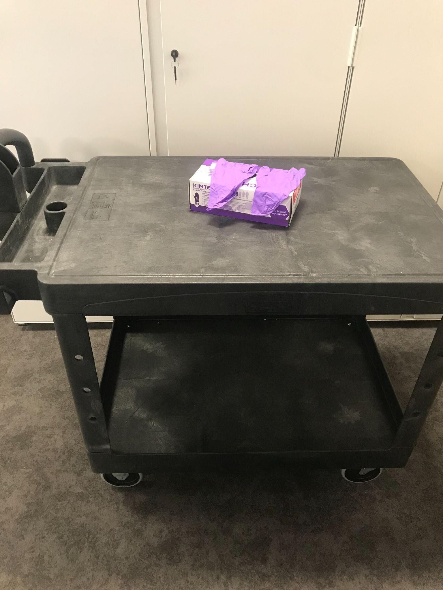

# **Safe Handling Guide for Special Collection 3-D Objects** 

## **Standard practices of all movement of collection materials for exhibitions, pop-ups, and other displays of collection items**

_Created June 2023_

## When handling special collection objects, the following practices are expected:

- AVOID wearing anything that might damage objects by scratching or snagging the surface, such as rings and other jewelry, watches, belt buckles, Library ID.

- NEVER eat or drink around objects.

- Handle objects only when necessary. 

- LOOK carefully at an object before lifting. Ask yourself:

  - Is the surface fragile?

  - Are there any clues to make me think it is damaged?

  - Where am I going to put the object, and is there a clear space set aside for it?

- Use carts for transport of materials.

  - Do not carry objects in your hands.

  - Object should not exceed the maximum weight capacity of the cart.   

- Use BOTH HANDS to lift an object.

- If an object is in a container, lift only the container.

- WEAR well fitted NITRILE GLOVES when lifting objects that can be damaged by bare hands (such as metal objects).

- If you break or damage something, tell the center Collection Manager and Registrar immediately. Take photos.

- Once objects are placed in display cases, the display case cannot be moved without deinstallation of materials.

## Supplies:

- Rubbermaid cart

- A-frame cart

- Nitrile gloves

Contact your research center's collection manager with questions. 